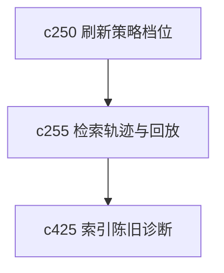

## Why

用户看到一组检索结果时，最容易追问的就是两件事：系统当时到底怎么搜的，为什么这次和上次不一样。没有查询轨迹和回放，检索只要稍微波动一点，就很难解释。

## What Changes

- 定义 retrieval query trace，记录查询改写、过滤条件、排序因子和关键来源时点。
- 支持 search replay，让用户或系统能回看一次检索当时的输入与结果边界。
- 区分可稳定回放的检索和依赖实时状态的检索，避免制造假一致性。
- 让查询轨迹既能服务调试，也能服务用户理解结果来源。

## Capabilities

### New Capabilities
- `retrieval-query-trace-and-search-replay`: 定义检索查询轨迹、搜索回放和结果边界解释。

### Modified Capabilities
- `retrieval-and-cache`: 需要保存查询轨迹与可回放上下文。
- `unified-search-query-and-rerank`: 统一搜索需要暴露查询轨迹和回放入口。
- `context-packing-and-token-budget-explainability`: 检索轨迹需要能给上下文装配解释提供输入。

## Impact

- Backend：会影响检索日志、回放元数据和搜索接口结构。
- Frontend：会影响搜索结果解释、调试视图和回放入口。
- Dependencies：这条线接在 `c250` 后面，也会和 `c425` 的索引陈旧诊断形成配套。

