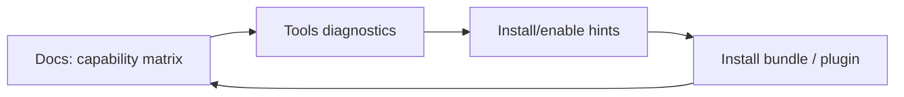

## Why

一旦引入“官方插件套件”，最容易产生的困惑不是“插件怎么写”，而是“我现在到底有什么能力”。对个人用户来说，这个问题要能在 30 秒内回答：core-only 能做什么？official-full 多了什么？缺了某个插件会表现成什么症状？

这份提案把答案写进 docs-site：不把 openspec 目录直接当页面渲染（遵循 `docs-site` 规范），而是提供一份 curated 的能力矩阵页，作为安装与排障的总入口。

## What Changes

- 新增 docs 页面：Official Plugins Capability Matrix（curated）：
  - 输出类型（output-*）、解析器（parser-*）、提取器（extractor-*）、连接器（connector-*）的列表。
  - 每项标注：属于 core-only 还是 official-full（或单插件安装）、以及缺失时的典型症状。
  - 链接到“如何自检”：tools/diagnostics API 与 UI 的对应入口。
- 与 troubleshooting hub 联动：
  - 把常见“缺插件”问题（PDF 空白、网页抓取失败等）指向这张矩阵，而不是重复写一份。
- 更新约定：
  - v1 可以先人工维护，但必须明确“更新责任点”和发布前检查项，避免矩阵过期。

## Capabilities

### New Capabilities

- `docs-official-plugins-capability-matrix`: 能力矩阵页的结构、更新约定与最低信息要求。

### Modified Capabilities

- `official-plugins-bundles-and-catalog-diagnostics`（`c247`）：矩阵页应复用 catalog 的命名与术语，避免两套 ID。
- `docs-site`：新增矩阵页的 nav 与组织规则。
- `doc-governance`：把矩阵页纳入受控更新范围（必要时加 drift-check 清单）。

## Impact

- Docs：降低安装与排障成本；也让插件体系更“可解释”。
- Engineering：迫使 plugin id 与 bundle 术语保持稳定；这对长期维护非常划算。
- Dependencies：强依赖 `c247`；并建议和 `c248-docs-troubleshooting-hub-and-debug-recipes` 一起落地，形成“自检 → 看矩阵 → 安装/启用”的闭环。

