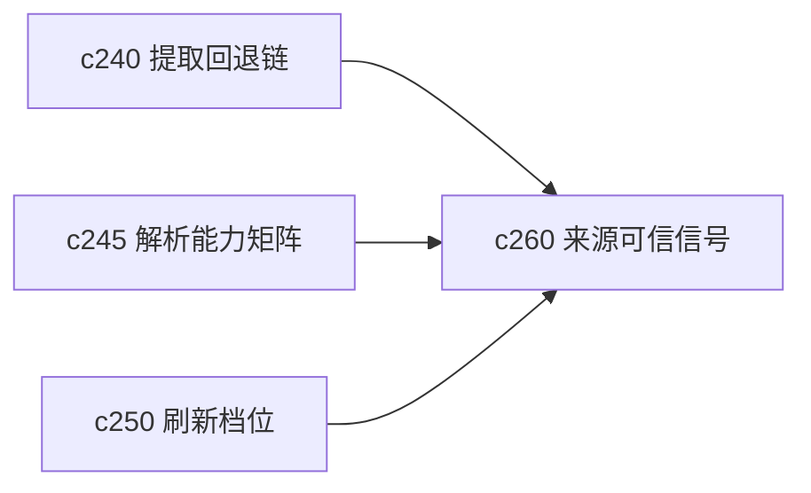

## Why

来源能抓下来，不代表用户就会信它。真正影响使用感的，常常是一些很朴素的判断：这份来源靠不靠谱、有没有明显缺页、是不是转载、文本质量是不是太差。现在这些信号还太隐。

## What Changes

- 定义 source trust signal，把来源完整性、重复风险、提取质量和最近验证情况收成可见提示。
- 增加 quality hint，用简短可理解的方式告诉用户“这份来源看起来哪里不稳”。
- 区分硬风险和软提示，避免所有来源都像在报警。
- 让信任信号参与来源详情、搜索结果和引用解释，而不是只留在内部评分。

## Capabilities

### New Capabilities
- `source-trust-signals-and-quality-hints`: 定义来源可信信号、质量提示和风险分级语义。

### Modified Capabilities
- `source-readiness-and-freshness`: 需要扩展到可信度提示，而不只看可用性。
- `source-coverage-and-evidence-map`: 覆盖图需要消费来源质量信号。
- `workspace-api-contract`: 需要暴露来源质量提示与风险字段。

## Impact

- Backend：会影响来源评分、诊断字段和聚合逻辑。
- Frontend：会影响来源卡片、详情提示和搜索结果说明。
- Dependencies：这条线和 `c240`、`c245`、`c250` 都是同一组来源可信链路里的用户可见面。

