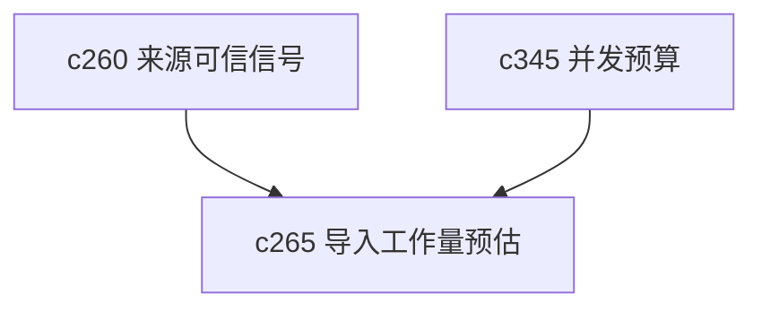

## Why

用户在导入一个大来源前，经常只是想知道一件事：这次会花多大力气，多久能完，大概要不要紧。现在如果只能点下去等，导入体验会一直偏黑箱。

## What Changes

- 定义 ingestion work estimate，在导入前给出大致工作量、潜在步骤和等待预期。
- 支持 budget preview，说明这次会触发哪些重任务，比如提取、解析、切块、索引和摘要。
- 区分粗略预估和已知确定项，避免把估算伪装成精确承诺。
- 让预估信息既服务用户决策，也服务系统后续调度和背压提示。

## Capabilities

### New Capabilities
- `ingestion-work-estimates-and-budget-preview`: 定义来源导入前的工作量预估和预算预览语义。

### Modified Capabilities
- `source-ingestion-core`: 需要在执行前补预估阶段。
- `background-jobs-and-task-runtime`: 需要把预估结果传给排队与背压层。
- `concurrency-budgets-and-backpressure-visibility`: 背压提示需要消费导入预估。

## Impact

- Backend：会影响预估器、任务准备阶段和队列提示。
- Frontend：会影响导入前提示、按钮文案和等待预期说明。
- Dependencies：这条线接在 `c260` 后面，一个解释来源质量，一个解释导入成本。

