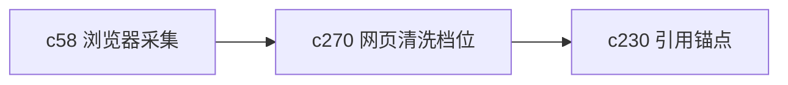

## Why

网页采集现在能进来，但“进来的是不是适合读、适合引、适合后续处理的正文”还不够稳定。很多页面真正麻烦的不是抓不到，而是抓进来一堆导航、广告和碎片。

## What Changes

- 定义 web capture cleaning profile，区分保守清洗、阅读优先、保真优先等不同档位。
- 增加 reader normalization，把网页正文整理成更稳定的阅读和引用形态。
- 保留清洗前后差异的最小摘要，方便用户判断这次清洗是不是过头了。
- 让清洗档位既能在浏览器采集时选择，也能在导入后重跑。

## Capabilities

### New Capabilities
- `web-capture-cleaning-profiles-and-reader-normalization`: 定义网页清洗档位、阅读归一和可回看差异语义。

### Modified Capabilities
- `browser-clipper-and-web-capture`: 需要支持清洗档位和重跑入口。
- `source-ingestion-summary-and-conversion`: 需要表达清洗前后差异与保真度。
- `citation-span-normalization-and-source-anchoring`: 阅读归一结果需要保持稳定锚点。

## Impact

- Backend：会影响网页预处理、差异摘要和重跑逻辑。
- Frontend：会影响浏览器采集、来源详情和清洗档位选择。
- Dependencies：这条线站在 `c58` 和 `c230` 中间，补的是正文质量这一段。

