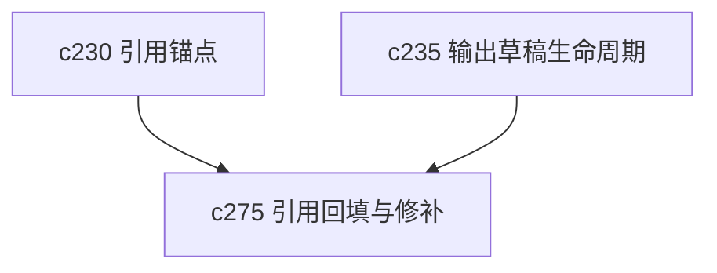

## Why

有些结果不是完全没有引用，而是差一点点就够用了。现在如果少几条证据，用户往往只能自己重跑整段内容。缺少一条“把缺口补上”的修补路径，会让很多本来还能救的结果被直接放弃。

## What Changes

- 定义 citation backfill，支持对缺失引用、弱证据段落和断开的锚点做定向修补。
- 区分自动补证据建议和需要用户确认的修补动作，避免系统悄悄改写结果。
- 让 backfill 结果能保持原始草稿上下文，而不是强制走全量重生成。
- 把修补动作接回 evidence review 和 output diff，对用户说明修了哪里。

## Capabilities

### New Capabilities
- `citation-backfill-and-missing-evidence-repair`: 定义引用回填、证据修补和局部确认语义。

### Modified Capabilities
- `evidence-review-workflow`: 需要支持从缺口直接发起修补动作。
- `citation-span-normalization-and-source-anchoring`: 需要支持新旧锚点合并与替换。
- `output-draft-lifecycle-and-regeneration-safety`: 需要支持局部修补而非全量重生成。

## Impact

- Backend：会影响局部检索、引用重装配和修补记录。
- Frontend：会影响引用缺口提示、修补入口和修补后的差异展示。
- Dependencies：这条线建立在 `c230` 和 `c235` 之上，是可信闭环里很实用的一步。

