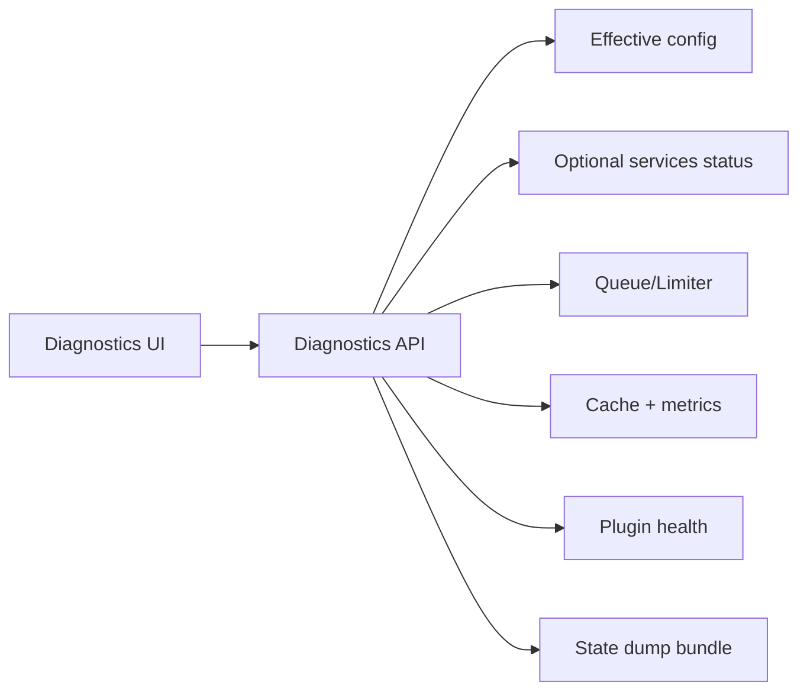

## Why

有了 correlation_id 之后，排障已经比以前好很多，但现实里仍会卡在“我去哪看这次的链路？”：日志分散、状态分散、可选服务状态分散。只要入口不收口，排障体验就会一直偏工程化，越用越累。

这份 change 的目标是做一个开发者友好的诊断台：把“系统当前状态”和“某次动作的线索”放到一个地方。

## What Changes

- 提供诊断入口（默认仅 dev/local 开启，可配置）：
  - optional services 状态（引用 `c17` 的契约）
  - task queue / limiter 状态（引用 `c39`）
  - cache epoch、命中率、最近错误摘要（引用 `c12`）
- 提供 state dump（可分享、默认脱敏）：
  - 当前配置摘要（redacted）
  - 插件加载列表与健康状态（引用 `c29`）
  - 最近 N 次 run 的摘要与 correlation_id
- 提供“导出包”：一键把 state dump + 诊断信息打包成文件（与 `c28` 的 repro pack 区分开：这是系统态，不是单次 run 的复现包）。

## Capabilities

### New Capabilities

- `dev-diagnostics-workbench`: 诊断入口、state dump、导出包与权限边界。

### Modified Capabilities

- `architecture-core`: debug/diagnostics 端点的边界（默认关闭/受保护）与输出规范。
- `workspace-ui-core`: diagnostics 页面/面板的入口与信息密度控制。
- `delivery-and-deployment`: 在不同 profile 下的默认开关与安全建议。

## Impact

- Backend：需要统一汇总状态的 API（而不是每个模块自己暴露一个 /health）。
- Frontend：增加一个开发者向页面即可（不要求给普通用户看）。
- Dependencies：建议与 `c12` 的诊断包字段对齐，这样 correlation_id 能真正“落地可用”。

## Dependency Sketch

