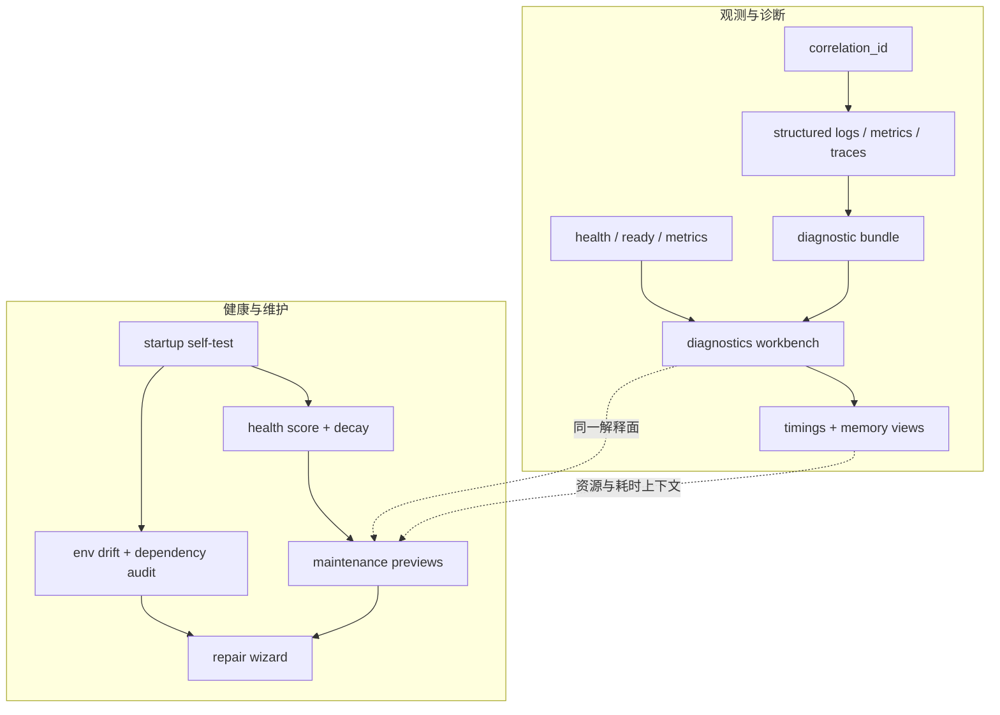

## Why

**观测与诊断**：`c2009` 把一次动作的链路串起，`c2020` 把线索收口为开发者可用的诊断入口；若分开推进，diagnostic bundle、correlation_id、timings、state dump 易重复定义且前后端契约断裂。**运维与自愈**：`c1001` 关注清理、压缩、失效与回收，`c1035` 关注进入工作前的健康、漂移与低风险修复；二者实为同一 maintenance loop——自检需指向可执行的维护/修复动作，维护工具又需健康度、漂移与风险上下文，否则只会「报问题」或「盲清理」。将 **观测诊断基座** 与 **启动健康、维护与修复向导** 统一，才能形成自托管场景下可扩展的最小排障与「先看健康 → 再修复/清理 → 再工作」闭环。

> 合并说明：本提案合并了原 `maintenance-startup-health-and-repair-loop` 的全部内容。

## 公共合成焦点

**Diagnostics** 产出可复制的关联键、bundle 与 timings/memory 视图；**maintenance / repair** 产出可预览的清理、失效与健康修复批次。公共闭环是：同一套信号既用于解释「当前哪里不对」（慢、胀、漂移、衰减），又用于驱动「下一步可执行动作」（预览后清理、wizard、回滚边界），避免自检只报状态、工具只敢盲清理。Redaction、权限分层与 dev/product 诊断密度在两条子线中保持一致，以免 export pack 与 repair 入口各用一套安全故事。

## 一体化原则（公共项收口）

1. **同一 redaction 策略**：diagnostic bundle、export pack、repair 预览、maintenance 报告复用结构化日志与 secret 红线的字段决策，禁止各端自行过滤。
2. **从信号到动作**：startup self-test 与健康分输出的每一项须映射到「可点击的下一步」（打开 diagnostics、运行失效预览、进入 wizard），不得止于文案告警。
3. **耗时与资源对照**：timings breakdown 与 memory/cache budget 视图使用同一时间基准与采样窗口说明，便于对照「慢」与「胀」是否同源。
4. **权限分层一致**：dev 高密度诊断与 product 低密度摘要的开关、路由与默认值在 delivery profile 中单一配置，避免前端与后端各判一次。

## Merge Notes（历史合并溯源）

- 本目录历史上已合并：`observability-bundle-and-traceability`、`dev-diagnostics-workbench-and-state-dumps`。
- 本次再合并自 `c4068` 所收口的：`storage-and-cache-maintenance-tooling`、`startup-self-test-baseline-and-drift-audits`。
- 合并自 `quiet-failure-detection-and-silent-degradation-alerts`。

## What Changes

1. **观测基础**：`correlation_id` 贯穿 HTTP / SSE / 后台任务 / 上游调用；结构化日志、最小指标集合、可选 tracing；`/health`、`/ready`、`/metrics`。
2. **Diagnostics workbench**：配置摘要、optional services、queue/limiter、cache、插件健康、最近 run 摘要等；区分 dev diagnostics 与 product diagnostics 信息密度。
3. **统一 diagnostic bundle / export pack**：后端 bundle 与前端导出字段对齐；默认脱敏、可分享、可 diff；禁止明文 secret 与大段正文泄露。
4. **Run timings 与性能时间轴**：queue_wait、rate_limit_wait、retrieve、model、persist 等阶段耗时标准化；支持 API 汇总与诊断 UI 时间轴。
5. **运行时内存预算与泄漏探测**：前后端关键缓存、buffer 与 heap/RSS 预算与趋势；超阈值时给出明确自救动作。
6. **维护工具**：footprint breakdown、重对象、retention 预览、cache epoch 检查、失效预览；生成资产清理、陈旧 bundle 检测、archive vacuum、存储压缩。
7. **启动自检与运行基线**：进入工作前快速检查关键配置、缓存、契约与依赖健康；输出可执行建议而非仅状态列表。
8. **工作区健康分与衰减信号**：来源陈旧、草稿堆积、本地膨胀、线程失联、静默退化等轻量信号；持续恶化标记为 decay。
    - **静默失败检测与退化提醒**：捕捉没有显式报错但质量或路径明显变差的执行（引用变松、缓存失效、步骤频繁降级）；对长期悄悄退化的链路做轻提醒；退化信号回接健康度、稳定性印章和契约失败分类；优先关注对真实工作感受影响大的静默问题。
9. **本地环境漂移与依赖审计**：依赖与生成工具版本漂移；升级风险与 migration hints、repair playbook 入口。
10. **修复向导与安全批处理**：常见低风险问题组织为可预览、可回滚的连续动作；local store 完整性检查与 healing 建议进入同一 repair loop。
11. **打通 maintenance 与 diagnostics**：自检、健康分、repair、cache 失效预览与 storage cleanup 共用同一套状态解释与后续动作入口。

## Capabilities

### New Capabilities

- `observability-bundle`：链路标识、日志/指标最小集合、脱敏与诊断包导出契约。
- `dev-diagnostics-workbench`：诊断入口、state dump、导出包与权限边界。
- `diagnostics-export-pack`：诊断包格式、包含集合、红线与 UI 入口。
- `run-timings-breakdown-and-perf-timeline-view`：timings 字段、输出时机与 UI 时间轴最小交互。
- `runtime-memory-budget-and-leak-detectors`：内存预算、趋势检测与诊断输出约定。
- `maintenance-tooling`：体检视图、预览式清理、保留策略与缓存治理契约。
- `cache-epoch-inspection-and-invalidation-preview`：cache epoch 检查、失效预览与作用范围语义。
- `storage-compaction-archive-vacuum-and-retention-preview`：存储压缩、归档整理与保留预览语义。
- `storage-footprint-breakdown-and-heavy-object-finder`：体积分解、重对象发现与清理前提示。
- `generated-asset-cleanup-and-stale-bundle-detection`：生成资产清理、陈旧 bundle 检测与确认边界。
- `operational-baseline-checklists-and-startup-self-test`：启动自检与运行基线检查单。
- `personal-workspace-health-score-and-decay-signals`：工作区健康度与衰减信号。
- `local-environment-drift-and-dependency-audits`：本地环境漂移与依赖审计。
- `dependency-upgrade-risk-notes-and-migration-hints`：依赖升级风险说明与迁移提示。
- `workspace-repair-wizards-and-safe-fix-batches`：修复向导与安全批处理。
- `local-store-integrity-checks-and-healing-suggestions`：本地存储完整性检查与修复建议。
- `quiet-failure-detection-and-silent-degradation-alerts`：静默失败检测和退化提醒。

### Modified Capabilities

- `generation-observability-and-guardrails`：统一 trace、timings、error kind 与取消/重试边界。
- `architecture-core`：diagnostics / debug 端点边界、装配位置与默认关闭策略。
- `workspace-ui-core`：诊断页面/面板与 startup health、maintenance actions 入口分层稳定。
- `delivery-and-deployment`：观测开关、默认值、运行成本、自托管排障与 `just cleanup`/maintenance 入口清晰。
- `workspace-api-contract`：correlation id、timings summary、diagnostic bundle 引用、health score、自检摘要、repair/maintenance preview 可被前端稳定消费。
- `request-context-and-correlation-ids`：与 diagnostics 输出与复制路径对齐。
- `task-phase-breakdown-and-progress-events`：phases 挂载时间戳、等待时间与最终汇总。
- `run-cost-time-estimates-and-interrupt-points`：预估与实际耗时可在同一 diagnostics surface 对照。
- `structured-logging-schema-redaction-and-error-sampling`：diagnostics bundle 与 export pack 复用同一 redaction policy。
- `tool-config-secrets-and-redaction`：诊断包禁止导出 secret 明文。
- `frontend-performance-marks-and-web-vitals-gates`：perf 摘要稳定导出格式。
- `storage-and-cache-maintenance-tooling`：diagnostics 提供 cache / memory 自救动作入口；compaction、retention、repair 边界稳定。
- `sse-server-side-buffering-backpressure-and-compression`：SSE buffer 进入 timings 与 memory budget 视图。
- `docs-troubleshooting-hub-and-debug-recipes`：稳定 diagnostics 使用路径文档。
- `run-postmortem-summaries-and-recommendation-loops`：复盘需要识别静默退化。
- `reproducibility-seals-and-result-stability-checks`：稳定性印章需要吸收静默失败信号。
- `contract-failure-taxonomy-and-repair-playbooks`：静默退化需要映射到失败分类。
- `data-and-storage`：compaction、retention、repair 边界明确。
- `retrieval-and-cache`：cache epoch、失效预览与降级信号可解释。

## Impact

- **Backend**：middleware、logger、metrics、health/readiness、bundle export、diagnostics 聚合 API，与维护预览、修复批次、漂移审计、自检聚合、健康评分统一为一条观测—运维闭环。
- **Frontend**：可持续扩展的 diagnostics surface，而非排障信息散落弹窗或 console；首页/诊断承接 startup health 与 maintenance 动作。
- **Operations**：自托管场景具备最小排障闭环；环境漂移、升级风险与本地损伤不仅靠人工排查。

## Dependency Sketch

