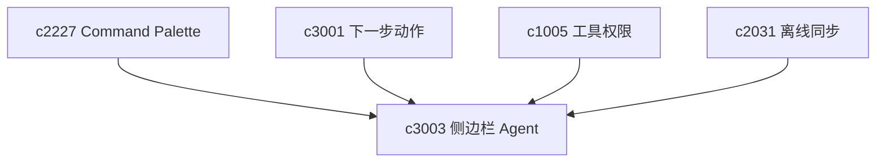

## Why

当功能越来越多，一个低摩擦入口会变得很重要。用户不一定每次都想走完整工作区流程，有时只是想快速问一句、存一段、跑一个小动作。没有轻入口，产品会越来越像“得专门坐下来用”的工具。

## What Changes

- 引入个人 Agent 侧边栏与全局热键入口，支持快速提问、快速采集和快速触发动作。
- 侧边栏动作需要能落到当前 workspace 或 Notebook 上下文，而不是游离在外。
- 默认采用保守权限策略，避免轻入口直接获得高风险能力。
- 让侧边栏与 Command Palette、推荐动作和离线同步共享同一套对象语义。

## Capabilities

### New Capabilities

- `personal-agent-sidebar-and-global-hotkey`: 定义轻量 Agent 入口、上下文绑定和快捷触发语义。

### Modified Capabilities

- `workspace-command-palette-and-shortcuts`: 需要共享命令索引和触发语义。
- `proactive-recommendations-and-next-best-actions`: 推荐动作需要能在侧边栏里承接。
- `agent-tool-permissions-and-sandbox-policy`: 轻入口需要默认受更严格策略保护。
- `local-first-offline-sync-and-conflict-resolution`: 轻采集和草稿需要支持本地暂存。

## Impact

- Backend：需要轻量会话入口、上下文装配和权限裁剪。
- Frontend：需要全局热键、侧边栏 UI 和当前对象绑定。
- Product：这条线会提高日常打开频率，但必须和权限边界一起设计。

## Dependency Sketch

