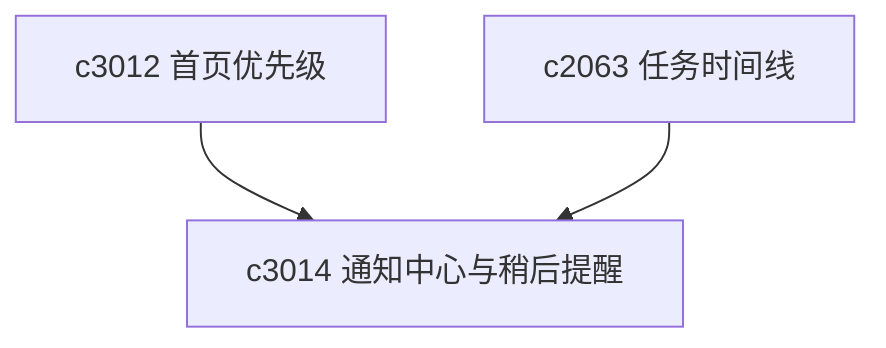

## Why

提醒这件事如果做得太响，会烦；如果完全没有，又容易漏掉真正该处理的东西。个人工作台更适合的是一个轻量通知中心，能把值得你回头看的变化收起来，而不是把你一直拽走。

## What Changes

- 定义 workspace notification center，统一收纳来源变化、任务完成、输出生成、失败恢复和待续工作提醒。
- 支持 snooze rule，让用户对某类提醒临时静音或延后，而不是只能永远开着。
- 区分信息提示、建议处理和高优先级阻塞，避免所有提醒都长得一样。
- 让通知既能回跳原对象，也能在通知中心直接标记稍后处理或忽略。

## Capabilities

### New Capabilities
- `workspace-notification-center-and-snooze-rules`: 定义工作区通知中心、提醒分级和稍后提醒规则。

### Modified Capabilities
- `workspace-home-and-operating-cockpit`: 首页需要和通知中心共享待处理信号。
- `background-jobs-and-task-runtime`: 任务完成与失败信号需要进入正式提醒流。
- `workspace-ui-core`: 需要承载通知中心、已读态和延后规则。

## Impact

- Backend：会影响提醒事件聚合、已读状态和延后规则存储。
- Frontend：会影响通知中心、角标和延后交互。
- Dependencies：这条线承接 `c3012` 的优先级折叠，也会与 `c2063` 的任务时间线形成互补。

