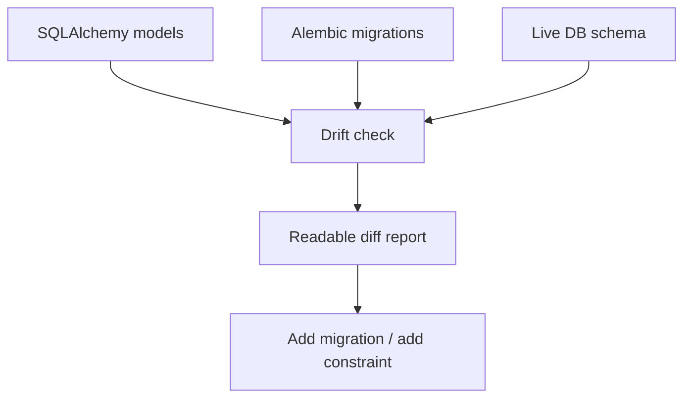

## Why

我们同时支持 SQLite（local）和 Postgres（docker/full），还在不断加新对象、新索引。只要迁移稍微漂一下，问题就会在最糟的时候爆出来：线上/本地行为不一致、数据丢失、或者某个查询突然慢到不可用。

与其在事故后补救，不如把“迁移漂移”和“约束缺失”变成可提前发现的门禁。

## What Changes

- 定义 DB hygiene 的最低标准：
  - 外键/唯一约束/必要索引必须显式存在（不能只靠 ORM 约定）
  - 对关键查询提供索引覆盖说明（先从 sources/sessions/outputs 这些热表开始）
- 引入 drift gate（本地与 CI 都可跑）：
  - 对比 ORM schema、alembic migrations、以及当前数据库的实际 schema
  - 产出可读 diff（缺了哪个 index/constraint）
- 明确迁移的 rollback 边界与实践约定：
  - 哪些迁移必须可逆、哪些可以不可逆但要写清楚
  - SQLite 与 PG 的差异如何处理（不做“假装一致”，而是明确差异）

## Capabilities

### New Capabilities

- `db-migration-drift-gates`: schema drift 的检测方式、diff 输出、以及 rollback 边界约定。

### Modified Capabilities

- `data-and-storage`: 关键表的约束/索引要求与迁移策略。
- `delivery-and-deployment`: drift check 的命令入口与 CI 挂钩方式。

## Impact

- Backend：迁移会更“认真”，但这能换来长期稳定；也能降低“某个环境突然炸了”的概率。
- DX：当 drift 出现时，开发者能在本地第一时间看到，而不是把锅甩给环境。
- Dependencies：建议先用 `c08` 的对象模型把核心关系定清楚，再补齐约束与索引。

## Dependency Sketch

