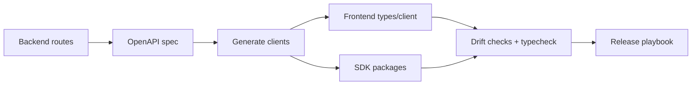

## Why

后端 API 演进快的时候，最先受伤的是前端和 SDK：类型漂移、错误码不一致、生成客户端忘了同步，最后用户看到的就是“前端坏了”。这类问题并不难解决，难的是缺少稳定的门禁和发布流程。

把 OpenAPI/client generation 变成“改了就必须对齐”的硬规则，会让我们少掉一大类重复劳动。

## What Changes

- 明确 OpenAPI 是契约，客户端是产物：
  - 任何会影响 API 的改动必须能生成新的 OpenAPI，并触发 client sync。
  - 前端生成入口明确为 `cd frontend/web && pnpm run api:sync`（已有），并补齐 drift check。
- 引入 client drift gate：
  - CI 校验 generated client 是否与 OpenAPI 一致（不允许偷偷漂）。
  - 对错误响应（ErrorResponse）做额外校验，避免“HTTP 200 + 错误字符串”这类奇怪形态。
- 引入 SDK release playbook（不求自动化到极致，但要可重复）：
  - npm 包 `@crystalith/sdk` 与 PyPI `crystalith-sdk` 的版本策略与发布步骤
  - 当出现 **BREAKING**（字段/路径/错误码变更）时，如何升级版本与迁移说明

## Capabilities

### New Capabilities

- `sdk-release-playbook`: client generation、drift gate、版本策略与发布流程。

### Modified Capabilities

- `openapi-and-client-generation`: OpenAPI 生成/消费、ErrorResponse 契约与 drift gate 的要求。
- `delivery-and-deployment`: `api:sync`、typecheck、以及发布前检查清单的标准入口。
- `public-repo-hygiene`: release/checklist/变更说明的最低规范。

## Impact

- Frontend：生成的 types 与 client 更可靠；改动失败会在 CI 暴露而不是在用户浏览器里爆。
- Backend：需要更认真对待 error contract（与 `c34` 的错误 UX 会互相促进）。
- Dependencies：建议先把 `c09` 的 SSE 错误表达与 HTTP 对齐，再把 OpenAPI error contract 的门禁收紧。

## Dependency Sketch

