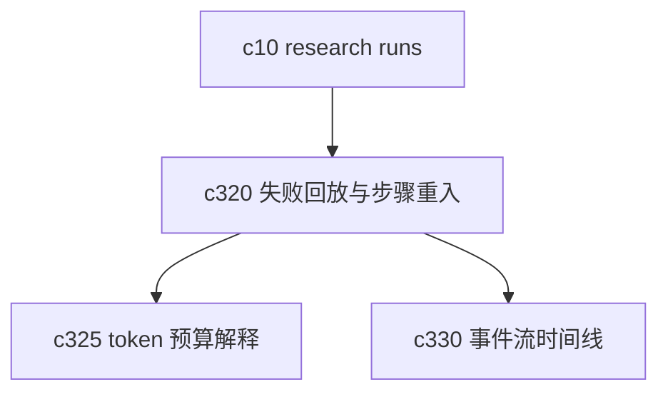

## Why

长任务的难点不是“能不能跑起来”，而是“中间坏了以后还能不能接着跑”。现在 research run 方向已经有了，但失败回放和步骤重入还没单独收口。没有这层，run 再长也只像一个更昂贵的黑箱。

## What Changes

- 定义 research run 的 replay boundary，明确哪些阶段可以重放，哪些阶段只能重建。
- 支持 step re-entry，让用户从失败步骤、人工检查点或指定阶段重新进入，而不是总是从头开始。
- 为 replay 记录输入快照、上下文摘要和关键参数，避免“点了重试但这次又不是同一件事”。
- 区分可恢复失败、需人工修正失败和不可重放失败，让 run 恢复路径更清楚。

## Capabilities

### New Capabilities
- `research-run-failure-replay-and-step-reentry`: 定义研究任务的失败回放、步骤重入和恢复边界。

### Modified Capabilities
- `background-jobs-and-task-runtime`: 需要支持阶段重放、重入点和恢复上下文。
- `generation-core`: 生成步骤需要暴露可重放输入与关键参数摘要。
- `workspace-api-contract`: 需要增加 replay、step re-entry 和失败类型查询接口。
- `generation-observability-and-guardrails`: 需要把回放和失败分类纳入可观察信号。

## Impact

- Backend：会影响 run 状态机、步骤快照、任务恢复和日志结构。
- Frontend：会影响 run 详情页、失败提示、恢复入口和 replay 预览。
- Dependencies：这条线是 `c10-agentic-research-runs` 的直接补件，也会给 `c325` 和 `c330` 提供更清楚的输入。

