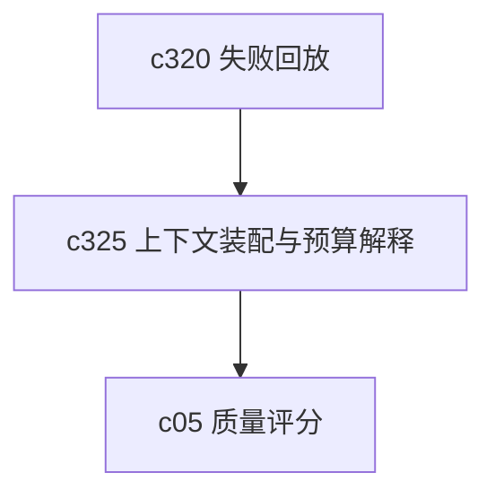

## Why

生成结果好不好，很多时候不是模型本身的问题，而是上下文怎么装进去的。现在系统已经有 RAG、压缩、检索和生成，但 token 预算和上下文取舍还不够可见。用户一旦开始认真比较结果，这块迟早会被追问。

## What Changes

- 定义 context packing 过程的可解释摘要，说明来源片段、历史对话、结构化信号各占了多少预算。
- 支持 token budget breakdown，让用户看见“为什么这次放了这些，没放那些”。
- 为不同生成模式补稳定的 packing policy 边界，减少同类请求表现波动太大。
- 把上下文裁剪、压缩和预算超限从内部实现细节提升为正式诊断能力。

## Capabilities

### New Capabilities
- `context-packing-and-token-budget-explainability`: 定义上下文装配、预算拆分和取舍解释语义。

### Modified Capabilities
- `generation-core`: 需要暴露生成前的上下文装配摘要。
- `source-aware-generation-modes`: 不同模式需要声明各自的上下文优先级。
- `generation-observability-and-guardrails`: 需要增加预算占用和裁剪原因信号。
- `retrieval-and-cache`: 检索结果需要能解释为何被纳入或被裁掉。

## Impact

- Backend：会影响上下文装配器、压缩逻辑、日志字段和诊断接口。
- Frontend：会影响研究详情、输出解释面板和高级调试视图。
- Dependencies：这条线紧贴 `c320` 的失败回放，也会给 `c05-quality-scorecards-and-eval-center` 提供更可比较的上下文解释维度。

