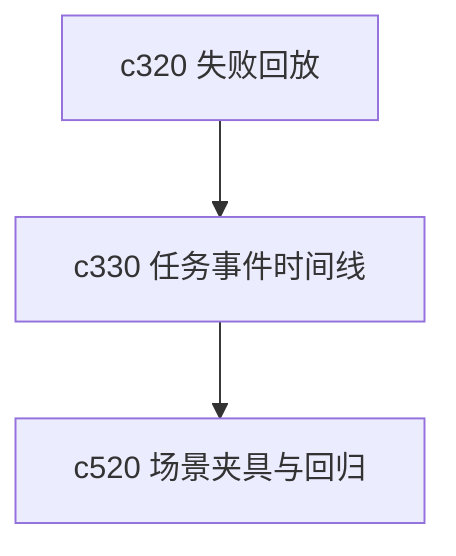

## Why

任务和 run 一旦开始变长，日志就会自然膨胀。可真正有用的东西，通常不是每一条内部事件，而是“发生了哪些关键阶段变化”“哪里卡住了”“我现在还能怎么接着做”。没有事件压缩层，时间线只会越来越吵。

## What Changes

- 定义 task feed compaction，把高频内部事件收成稳定的阶段节点和摘要事件。
- 增加 event timeline，让任务、research run、来源同步和输出生成都能投到同一种时间线语义里。
- 区分用户需要看的事件、调试事件和审计事件，避免一个视图塞所有东西。
- 让时间线天然支持回放、定位失败点和回跳相关对象，而不是只做只读流水账。

## Capabilities

### New Capabilities
- `task-feed-compaction-and-event-timeline`: 定义任务事件压缩、阶段时间线和多视图事件分层语义。

### Modified Capabilities
- `background-jobs-and-task-runtime`: 需要输出可压缩的阶段事件，而不只是原始日志。
- `generation-observability-and-guardrails`: 需要把运行信号接入同一条时间线。
- `workspace-api-contract`: 需要提供任务时间线、事件分层和定位接口。

## Impact

- Backend：会影响任务事件模型、日志压缩、时间线查询和阶段摘要。
- Frontend：会影响 task 面板、run 详情、研究视图和错误追踪体验。
- Dependencies：这条线直接服务 `c320` 的失败回放，也会给 `c520` 的场景回归提供更稳的观察面。

