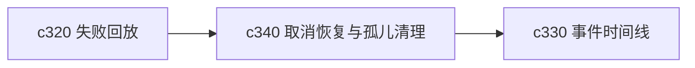

## Why

长任务一旦真的开始跑，用户迟早会做三件事：中途取消、稍后继续、怀疑后台还有没收掉的残留任务。现在如果这三件事都没有正式语义，运行时会慢慢变脆。

## What Changes

- 定义 task cancellation 和 resumption 的正式边界，明确哪些任务能安全取消，哪些只能请求停止。
- 增加 orphan cleanup 语义，识别失去前台关联、状态漂移或资源未释放的任务。
- 区分用户主动取消、系统回收和异常中断，避免它们都落成同一种结束状态。
- 让任务恢复和清理结果能回到 research run、compute job 和来源复查任务。

## Capabilities

### New Capabilities
- `task-cancellation-resumption-and-orphan-cleanup`: 定义任务取消、恢复和孤儿任务清理语义。

### Modified Capabilities
- `background-jobs-and-task-runtime`: 需要支持取消请求、恢复点和回收逻辑。
- `agentic-research-runs`: run 需要明确取消与恢复的用户语义。
- `generation-observability-and-guardrails`: 需要把孤儿任务与回收动作纳入正式信号。

## Impact

- Backend：会影响 worker、queue、任务状态机和回收逻辑。
- Frontend：会影响任务详情、取消入口、恢复入口和任务状态提示。
- Dependencies：这条线是 `c320` 的近邻补件，也会给 `c330` 的事件时间线提供更完整的生命周期。

