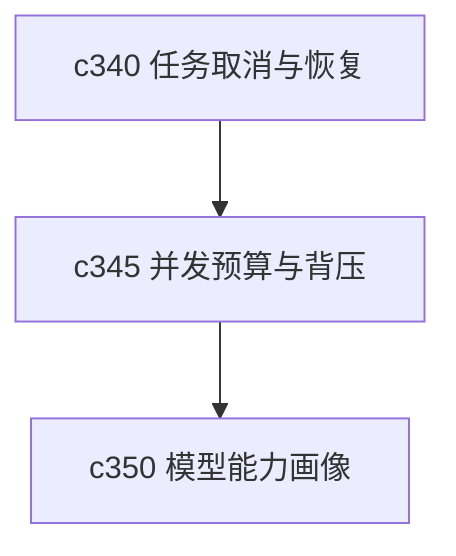

## Why

任务一多，系统不一定直接坏，但会先变得“有点堵”。真正难受的不是慢，而是不知道为什么慢、慢在谁前面、现在该不该再发一个任务。并发预算和背压如果一直藏在内部，用户和开发者都会猜。

## What Changes

- 定义 concurrency budget，让不同任务类型有可解释的并发配额和等待边界。
- 增加 backpressure visibility，让前台能看见当前任务是排队、被限流还是资源紧张。
- 区分全局预算、任务类型预算和来源/模型相关预算，避免一个重任务把所有东西一起拖死。
- 让背压信号回流到任务详情、命令入口和生成前提示。

## Capabilities

### New Capabilities
- `concurrency-budgets-and-backpressure-visibility`: 定义并发预算、背压状态和等待解释语义。

### Modified Capabilities
- `background-jobs-and-task-runtime`: 需要支持预算求值和背压状态回写。
- `generation-observability-and-guardrails`: 需要把预算与限流变成正式可见信号。
- `workspace-api-contract`: 需要增加队列状态和预算摘要接口。

## Impact

- Backend：会影响 queue、限流器、任务调度和状态暴露。
- Frontend：会影响任务提示、按钮禁用逻辑和等待说明。
- Dependencies：这条线和 `c340` 一组，也会给 `c350` 的模型能力兼容性提供实际运行约束。

