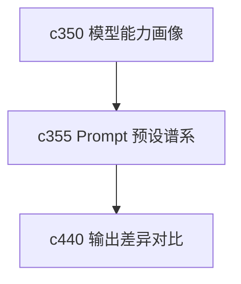

## Why

Prompt preset 一开始少的时候还好，数量一多以后，真正难的是知道它从哪来的、改过几版、为什么这版结果变了。没有谱系和迁移语义，预设会越来越像一堆好像能用、又不太敢动的快照。

## What Changes

- 定义 prompt preset lineage，记录预设的来源、继承关系和关键变更点。
- 支持 preset migration，让旧预设升级到新结构时有清晰路径，而不是静默失效。
- 区分官方基线、用户副本和实验变体，减少预设之间互相覆盖。
- 让预设变更能和模型兼容性、输出类型偏好一起解释，而不是孤立存在。

## Capabilities

### New Capabilities
- `prompt-preset-lineage-and-migration`: 定义预设谱系、迁移路径和变体边界。

### Modified Capabilities
- `chat-prompt-presets`: 需要支持谱系、继承和迁移提示。
- `generation-presets-and-constraints`: 需要把 prompt preset 的变化接到生成控制面。
- `workspace-api-contract`: 需要增加谱系查询、迁移建议和副本关系接口。

## Impact

- Backend：会影响 preset 存储模型、迁移规则和查询接口。
- Frontend：会影响预设管理、复制、升级提示和差异展示。
- Dependencies：这条线承接 `c350`，也会给 `c440` 的输出对比提供更清楚的背景上下文。

