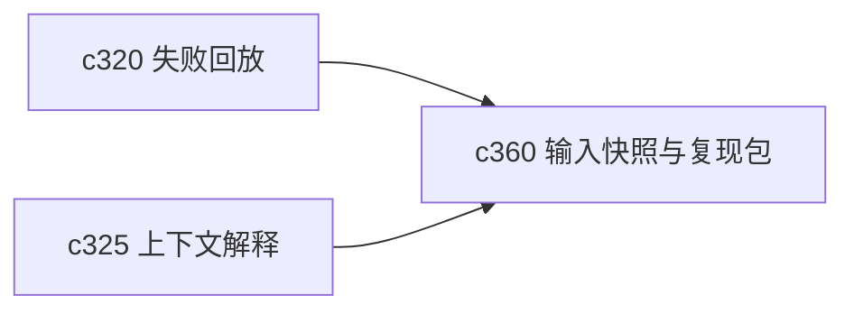

## Why

任务能回放是一回事，任务输入能不能被完整解释又是另一回事。真正到排查差异的时候，大家最想知道的是：当时到底拿了什么输入、什么预设、什么来源快照。没有输入快照，复现永远差一口气。

## What Changes

- 定义 run input snapshot，记录一次 run 的关键输入、模型选择、预设版本和来源时点。
- 支持 repro pack，把复现所需的最小上下文打包成稳定对象，而不是散在日志里。
- 区分可直接复现和仅供诊断的快照，避免误导用户以为所有 run 都能一比一回放。
- 让 repro pack 能被失败回放、质量评测和问题复盘复用。

## Capabilities

### New Capabilities
- `run-input-snapshots-and-repro-packs`: 定义运行输入快照、复现实验包和可复现边界。

### Modified Capabilities
- `agentic-research-runs`: run 需要暴露稳定输入快照。
- `context-packing-and-token-budget-explainability`: 上下文装配结果需要能进入 repro pack。
- `quality-and-regression`: 回归与评测需要消费真实 run 快照。

## Impact

- Backend：会影响 run 元数据、快照存储和复现打包逻辑。
- Frontend：会影响 run 详情、复现入口和诊断说明。
- Dependencies：这条线和 `c320`、`c325` 一起，补齐可复现这一段。

