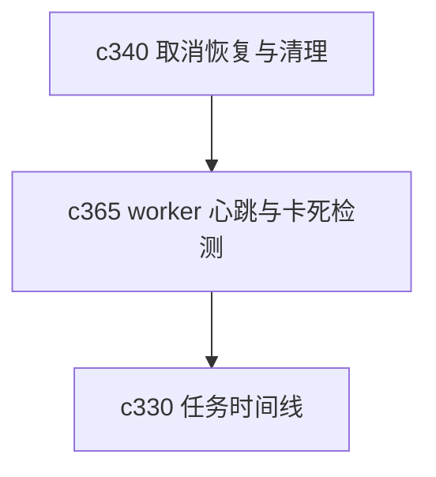

## Why

后台任务系统只要跑久了，就一定会遇到一种很烦的状态：没完全死，但也不动了。用户看到的是一直转圈，开发者看到的是状态半活不活。没有心跳和卡死检测，很多问题都只能靠猜。

## What Changes

- 定义 worker heartbeat，让执行器周期性回报活跃状态和关键进度。
- 增加 stuck job detection，识别长时间无进展、心跳异常或状态漂移的任务。
- 区分暂时等待和真正卡死，避免过度回收正常慢任务。
- 让卡死检测结果回流到任务时间线、通知中心和孤儿任务清理。

## Capabilities

### New Capabilities
- `worker-health-heartbeats-and-stuck-job-detection`: 定义 worker 心跳、卡死判断和告警语义。

### Modified Capabilities
- `background-jobs-and-task-runtime`: 需要支持心跳上报与卡死分类。
- `task-feed-compaction-and-event-timeline`: 需要把卡死和恢复事件纳入时间线。
- `workspace-notification-center-and-snooze-rules`: 需要对高优先级卡死事件提供提醒。

## Impact

- Backend：会影响 worker、状态机、健康检查和回收逻辑。
- Frontend：会影响任务详情、卡死提示和恢复入口。
- Dependencies：这条线直接承接 `c340`，是运行时健康层的补件。

