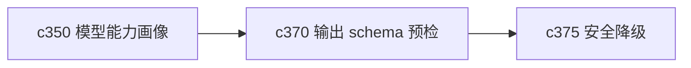

## Why

有些生成失败，其实在真正调用模型之前就已经注定会出问题了。输出类型、模型能力、上下文结构和 schema 要求不匹配时，如果还让任务跑进去再报错，体验会一直偏硬。

## What Changes

- 定义 preflight compatibility check，在生成前检查输出 schema、模型能力和输入结构是否兼容。
- 区分硬阻断和软警告，避免所有不完美情况都直接中止。
- 对不兼容原因给出更具体的解释，例如字段结构过复杂、模型不稳定支持结构化输出、上下文缺少必要对象。
- 让预检结果能被生成入口、任务运行时和模型选择器共享消费。

## Capabilities

### New Capabilities
- `preflight-output-schema-compatibility-checks`: 定义输出 schema 预检、兼容性判断和阻断边界。

### Modified Capabilities
- `model-capability-profiles-and-output-compatibility`: 需要提供预检所需的兼容性声明。
- `generation-core`: 需要在执行前接入预检结果。
- `studio-output-types`: 输出类型需要明确最小输入和 schema 要求。

## Impact

- Backend：会影响生成前校验、兼容性求值和错误分类。
- Frontend：会影响生成入口、预警提示和参数校验反馈。
- Dependencies：这条线承接 `c350`，并为 `c375` 的安全降级提供判断前提。

