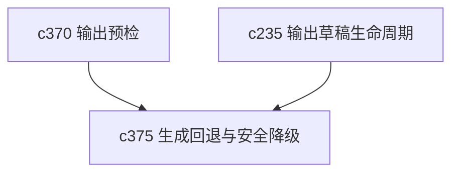

## Why

当首选路径跑不通时，系统不一定非得彻底失败。很多时候，用户宁可先拿到一个稍微弱一点但还可用的结果，也比直接报错强。关键在于这种降级必须可控、可解释，不能偷偷变味。

## What Changes

- 定义 generation fallback strategy，明确在模型、schema、上下文或工具能力不匹配时有哪些降级路径。
- 增加 safe degradation，要求系统说明降级后失去了什么能力、保留了什么能力。
- 区分用户明确允许的降级和系统默认不能替代的核心能力。
- 让降级结果能回到输出草稿和差异对比，而不是伪装成正常结果。

## Capabilities

### New Capabilities
- `generation-fallback-strategies-and-safe-degradation`: 定义生成回退策略、能力降级和解释边界。

### Modified Capabilities
- `generation-core`: 需要支持回退决策与降级结果标记。
- `preflight-output-schema-compatibility-checks`: 需要把可回退与不可回退区分开来。
- `output-draft-lifecycle-and-regeneration-safety`: 降级结果需要有更清楚的草稿状态。

## Impact

- Backend：会影响生成调度、回退策略和结果标记。
- Frontend：会影响降级提示、结果说明和后续重试入口。
- Dependencies：这条线站在 `c370` 后面，是“别直接死给用户看”的那一层。

