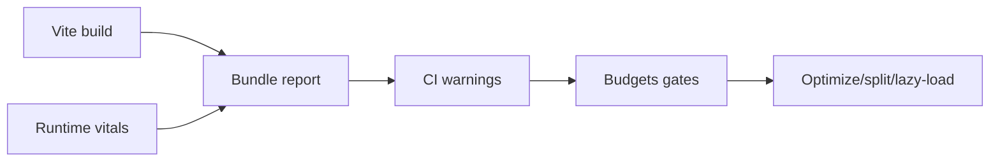

## Why

Workspace 会越做越“厚”：更多 panel、更多插件、更复杂的渲染。性能问题通常不是一次性崩掉，而是慢慢变差——等用户开始抱怨时，回头找是哪次改动引入的已经很痛苦。

我们需要把性能变成可度量、可对比、可门禁的东西：先从 Web Vitals 和最关键几条路径开始。

## What Changes

- 收集并记录最小 Web Vitals：
  - LCP / INP / CLS（按路由与关键操作打点）
  - 与具体构建产物绑定（commit/build id），可回看趋势
- 引入性能预算（budgets）：
  - bundle size（按入口/按插件包）
  - 关键路由首屏渲染时间（开发环境与生产环境区分）
  - 交互延迟阈值（INP）
- 引入“先 warn 后 gate”的门禁策略：
  - 先让 CI 输出报告与回归提示
  - 再逐步把关键预算变成阻断门禁
- 与插件 bundle 管理绑定：当某个插件引入明显回归时，能定位到具体 bundle（关联 `fullstack-plugin-bundles`）。

## Capabilities

### New Capabilities

- `web-performance-budgets`: vitals 采集、预算定义、报告与门禁策略。

### Modified Capabilities

- `workspace-ui-core`: 性能打点与关键交互的稳定性要求。
- `fullstack-plugin-bundles`: 插件 bundle 的拆分、命名与可追踪性要求。
- `delivery-and-deployment`: 性能报告的生成入口与 CI 集成方式。

## Impact

- Frontend：会增加一些打点与报告输出，但收益很直接：回归能更早发现，也更容易定位。
- DX：开发者会更快学会“哪些改动容易伤性能”，从而自带约束。
- Dependencies：建议与 `c34` 的错误恢复一起推进——性能与稳定性体验最终都落在前端。

## Dependency Sketch

