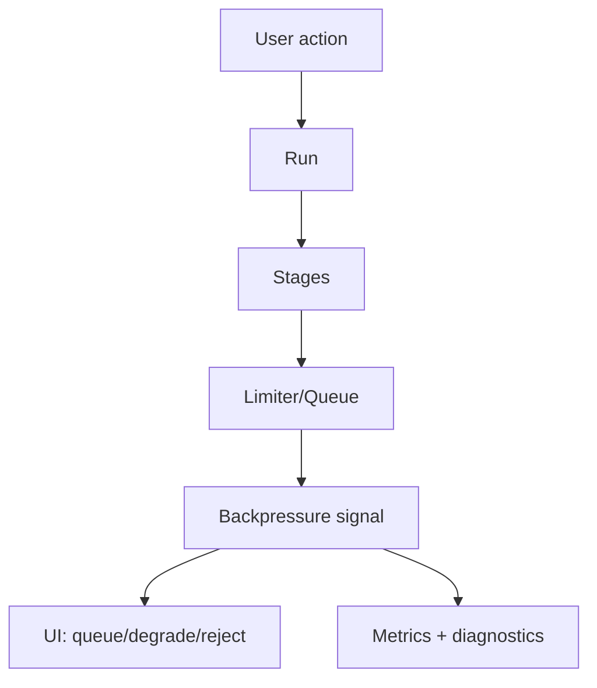

## Why

LLM、检索、解析、导出这些步骤都不便宜。只要并发稍微上来，最常见的现象就是“系统看起来还在跑，但越来越慢”，最后大家都在重试，雪上加霜。我们已经有 stage limiter/队列等基础设施，但它们对用户和前端几乎是黑盒。

背压不是性能优化的小技巧，它是系统能不能稳定服务的底层机制。需要把它变成可配置、可观察、可解释的契约。

## What Changes

- 定义并发预算（budgets）：
  - 按 stage（retrieval/embed/model/persist/export）设定并发上限与队列策略
  - 对不同 profile 给出默认值（关联 `c14`）
- 背压可视化：
  - API 暴露当前 limiter/queue 状态（深度、等待时间、拒绝原因）
  - 前端把“系统忙”的反馈做成可理解的提示，而不是纯转圈
- 明确背压下的行为：
  - 允许延迟/排队：展示预计等待与可取消
  - 允许降级：降低并发、降低检索范围、推迟非关键任务（规则写清楚）
  - 允许拒绝：给出明确原因与恢复动作（和 `c34` 的错误 UX 统一）

## Capabilities

### New Capabilities

- `backpressure-visibility`: 并发预算、背压信号、UI 反馈与降级策略的契约。

### Modified Capabilities

- `background-jobs-and-task-runtime`: limiter/queue 的统计输出与背压策略落地要求。
- `generation-observability-and-guardrails`: 背压信号如何进入诊断与指标体系（引用 `c12`）。
- `workspace-ui-core`: 前端对“排队/降级/拒绝”的用户提示与交互要求。
- `service-composition-profiles`: 不同 profile 下的默认预算与能力边界说明。

## Impact

- Backend：需要对 stage limiter 与队列做一层“可解释输出”；避免仅靠日志猜测。
- Frontend：用户会更少无意义地重试；也更容易理解“为什么现在慢”。
- Dependencies：建议先有 `c11` 的 run 生命周期与 `c12` 的观测字段，这样背压信号才能被准确归因与追踪。

## Dependency Sketch

