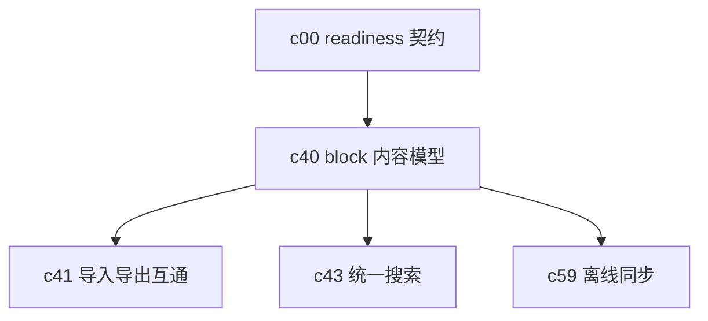

## Why

现在 Notebook 更像一个工作区容器，而不是一个真正可编辑、可审阅、可发布的内容对象。前面已经有 session、artifact、review、versioning 这些能力，但如果 Notebook 内部还是一整块模糊内容，后面的版本、导出、协作和离线同步都会越来越别扭。

## What Changes

- 定义 block-based notebook 内容模型，明确段落、引用、生成结果、表格、图表、附件等块级对象的职责边界。
- 让 block 自带来源、状态、创建方式和推荐动作，和 `c00` 的 readiness 语义对齐。
- 为前端补一个统一的 block editor 契约，让编辑、折叠、评论、引用跳转和审阅标注都围绕同一套模型展开。
- 把 Notebook 从“承载结果的页面”升级成“可以持续演化的正式产物”。

## Capabilities

### New Capabilities

- `notebook-content-model-and-block-editor`: 定义 Notebook 的块模型、编辑语义和块级引用关系。

### Modified Capabilities

- `workspace-object-model-and-readiness`: 需要把 Notebook block 纳入统一对象词汇。
- `workspace-ui-core`: 需要支持块级空态、恢复态和主路径操作。
- `workspace-ui-panels`: 各面板需要能落点到具体 block，而不是只停在 Notebook 级别。
- `artifact-versioning-and-release-channels`: 后续版本化要能按 block 理解变化，而不是只看整页快照。

## Impact

- Backend：需要新增 block 存储、块级引用和状态聚合逻辑。
- Frontend：需要围绕 block editor 重排 Notebook、引用、评论和跳转交互。
- Product：这是 `c41`、`c43`、`c59` 这几条线的共同底座，越早定清楚越省返工。

## Dependency Sketch

