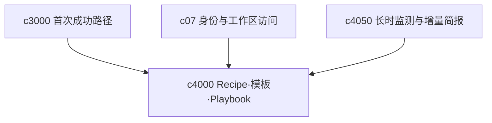

## Why

**主题**：工作流模板——recipe、playbook 与 workspace 模板。

Crystalith 已具备多种能力，但用户仍须自行决定先导入什么、再问什么、最后生成什么——能力多不等于任务顺手，缺的是「直接开干」的默认路径。与此同时，团队落地时会重复搭建：建 notebook、配来源、选 recipe、定审阅节奏；没有 workspace 模板与 operating playbook，产品更像高手工具，难以复制为可推广的工作方式。

**公共收口**：recipe（个人/场景起步）与 template/playbook（团队复用）解决同一类问题——**可启动的默认装配**（参数、输出类型、命令集）、**稳定入口**（空态/命令面板/组织默认）与**可版本化**（草稿/推荐/组织默认）；二者共享「启动后可编辑、可偏离」的产品契约，而非暗含全自动 agent。

## What Changes

1. **Recipe / 工作流起步**：引入 recipe/workflow，将常见任务打包为可一键启动的工作流；提供官方 recipe（如「资料导入 → briefing」「多来源对比 → report」「导入 → slides + quiz」等）；支持预填输出类型、提示词、参数与推荐步骤。
2. **入口与边界**：recipe 可从空态、命令面板与 Studio 启动；明确 recipe 是起步入口而非全自动 agent，启动后必须可编辑、可偏离；先覆盖真实高频起步场景，模板市场/评分/公开分享等后置。
3. **Workspace 模板与 Playbook**：引入 workspace template 与 operating playbook，将研究流程、角色分工、默认输出与审阅节奏打包为可复用模板。
4. **从模板实例化**：支持从模板创建 notebook、批量初始化来源结构、默认命令集、推荐结果类型与协作入口；维护 playbook 版本，区分草稿模板、推荐模板与组织默认模板。
5. **横向挂接**：让 onboarding、recipes、审批、分享与周期性监测挂接到 playbook，避免各自孤立配置；playbook 变更应能解释「为何默认如此」，便于审计与新人上手。

## 合并焦点（公共项）

- **装配顺序与覆盖规则**：当同时存在组织默认 playbook、workspace 模板与 recipe 启动参数时，须定义显式优先级（谁覆盖谁）与冲突提示，避免静默丢配置。
- **发现与治理**：模板/playbook 需要列表、搜索、所有权与弃用路径；recipe 需要稳定「官方精选」与扩展位，二者在 UI 上不应拆成两个互不知晓的入口。
- **可观测**：从模板实例化或 recipe 启动到第一步 run，应能追溯到「用了哪版 playbook/recipe、谁改的默认值」，满足团队复盘与合规抽查的最小要求。

## Capabilities

### New Capabilities

- `workflow-recipes`：工作流模板、默认参数与启动入口。
- `workspace-templates-and-playbooks`：工作区模板、流程手册、默认动作集与组织级复用。

### Modified Capabilities

- `workspace-ui-core`：recipe 入口与上下文展示；从模板创建工作区、模板来源与 playbook 切换入口。
- `workspace-command-registry`：recipe 级动作与快捷启动；模板注入的默认动作与按 playbook 暴露的上下文命令。
- `generation-presets-and-constraints`：recipe 预设对生成参数的约束。
- `studio-output-types`：输出类型选择器接收 recipe 预配置。
- `chat-prompt-presets`：模板级 prompt preset 继承与组织推荐配置。
- `multi-notebook-collections`：模板作用于单 notebook 或 notebook 集合。
- `workspace-api-contract`：模板目录、实例化与 playbook 版本查询的正式接口语义。

## Impact

- **Frontend**：模板/recipe 选择器、卡片、上下文状态、启动流程；playbook 说明页、基于模板的创建流与来源提示。
- **Backend**：模板描述模型、默认参数装配、官方 recipe 注册；模板定义存储、实例化、组织默认项与版本关系。
- **Product**：从「每次重搭」走向「可复制的团队方法」。
- **风险与权衡**：底层能力演进会抬高 recipe 维护成本；recipe 过多带来选择负担，须收敛高频场景与稳定入口。

**非目标（沿用 c4000 边界）**：不把 recipe 系统做成脚本执行平台；本变更不建设模板市场、评分与推荐；recipe 不反向定义生成类型体系（仅起步路径与默认值装配）。

## Dependency Sketch

> 合并说明：本提案合并了原 `workspace-templates-and-operating-playbooks` 的全部内容。
