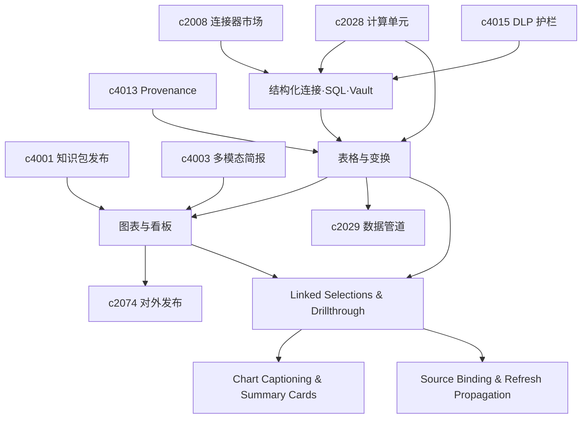

## Why

**主题**：数据与可视化——连接器、表格、图表与看板。

文档与网页只是知识来源的一部分；许多团队的核心数据在数据库、数仓与 BI 中。没有结构化数据连接器，研究能力易偏向「会写材料」而弱于「会算事实」。同时，连接器与凭据增多后，密钥若散在环境变量与文档中，轮换、交接与私有部署风险集中。仅有计算与 SQL 仍不够：用户需要在此「看、改、比」的表格层消化数据；表格之上还需要图表与 dashboard 作为沟通层，否则判断仍退回大段文字。

**公共收口**：三层栈共用同一套「可引用、可复现、可发布」的对象语义——SQL/连接器产物、表格变换快照与图表配置均落为 Notebook/workspace 正式块，并进入 provenance、刷新与下游 briefing/slides，而不是前端临时态或导出即丢。

## What Changes

1. **结构化连接器与 SQL 工作流**：定义连接器宿主语义（表、视图、查询结果、字段元数据的最小公共词汇）；引入 SQL workflow（生成、审查、执行、结果回写）；查询结果进入 Notebook 与后续生成链路，成为可引用对象。
2. **密钥与审计**：引入 secrets vault（按 tenant、environment、connector scope）；凭据轮换、过期提醒、灰度切换与回滚；凭据使用纳入审计；敏感字段与执行审计从第一天进入工作流。
3. **表格 / DataFrame 视图**：正式 table/dataframe 视图（过滤、排序、分组、采样、差异比较）；轻量 transformations 与可复用步骤；结果落为 Notebook block，供图表、报告与导出复用；表格操作进入审计、复现与版本链路。
4. **图表与 Dashboard**：为 Notebook 与 workspace 引入 chart block 与 dashboard；从表格生成常见图表，保留查询、筛选与时间范围语义；图表进入发布、briefing 与 slides；定义刷新、失效与上游依赖状态语义，并与 `c2029` 数据管道物化结果对齐挂接方式。
5. **表图联动与钻取（linked selections & drillthrough）**：定义 linked selection，使表格、图表与相关来源在选中状态上联动；支持 drillthrough，从图表点位回到表格行、来源片段或 notebook 块；统一过滤、时间范围与局部聚焦。
6. **图表说明与摘要卡（chart captioning & visual summary cards）**：定义 chart captioning（可读标题、注释与要点）；支持 visual summary card；区分自动生成与用户修订，避免刷新冲掉人工编辑。
7. **来源绑定与刷新传播（figure-table source binding & refresh propagation）**：定义 figure/table source binding，使图表与依赖的来源片段显式关联；增加 refresh propagation，在来源更新或证据等级变化时提示需复核的图表与表格；区分数据变化、描述变化与可信度变化对刷新的影响。

## Capabilities

### New Capabilities

- `structured-data-connectors-and-sql-workflows`：结构化接入、SQL 编排与结果回写。
- `secrets-vault-and-credential-rotation`：敏感凭据存储、轮换与审计。
- `table-view-dataframes-and-transformations`：表格视图、数据变换与结果沉淀。
- `charts-dashboards-and-data-storytelling`：图表块、看板与数据表达语义。
- `table-chart-linked-selections-and-drillthrough`：表格图表联动、钻取与共享过滤。
- `chart-captioning-and-visual-summary-cards`：图表标题说明、视觉摘要卡与复用边界。
- `figure-table-source-binding-and-refresh-propagation`：来源绑定、刷新传播与影响提示。

### Modified Capabilities

- `connectors-sync-catalog`：支持数据库类连接器。
- `sandboxed-compute-cells-and-kernel-runtime`：SQL 与计算结果映射到 dataframe/表格层。
- `dlp-redaction-and-sensitive-data-guards`：字段级敏感识别与放行。
- `private-deployment-and-regional-data-plane`：私有部署密钥托管边界。
- `compliance-retention-and-data-governance`：凭据使用符合治理要求。
- `provenance-and-reproducible-runs`：表格变换可回放与比较。
- `workspace-ui-panels`：表格对象浏览与落地交互。
- `publish-and-share-knowledge-packs`：知识包承载图表与 dashboard 摘要。
- `multimodal-audio-video-briefings`：简报消费图表结论。
- `studio-output-system`：图表型产物编排。
- `cross-panel-selection-and-deep-link-contract`：钻取落到统一定位规则。
- `briefing-assembly-board-and-evidence-pinning`：插入视觉摘要卡。
- `timeline-evidence-bands-and-source-drillback`：时间线证据变化波及相关图表。

## Impact

- **Backend**：结构化连接器接口、SQL 审核与执行编排、结果物化；凭据引用、加密、轮换与审计；dataframe 元数据、变换流水与快照；图表配置持久化、刷新与依赖追踪。
- **Frontend/Admin**：schema 浏览、查询预览、表格落地与风险提示；凭据配置、健康与轮换界面；高可用表格、差异视图；图表渲染、交互过滤与 dashboard 编排。
- **Product**：提升分析型场景可信度、汇报与对外展示说服力；表格层是图表与数据管道成立的中间层。

## Dependency Sketch

> 合并说明：本提案合并了原 `table-view-dataframes-and-transformations`、`charts-dashboards-and-data-storytelling`、`table-chart-linked-selections-and-drillthrough`（含 `c4039`、`c4043`）的全部内容。
