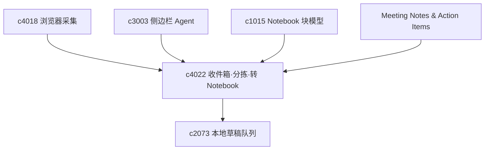

## Why

**主题**：轻采集——收件箱、分拣与转 notebook。

用户常不是在「正式整理」，而是路过时记下一段话、链接或判断；轻采集入口若不像统一收件箱，内容会先散落再补收拾。收件箱能兜住临时内容，但兜住不是终点——关键是何时把散件变成 notebook 里的结构化内容；缺少轻量转换路径，收件箱只会越积越厚。

**公共收口**：采集落地、triage 与「转 notebook」共用轻量元数据（来源类型、标签、摘要）与**回链**；API 上区分**预览结构建议**与**提交写入**，避免一次操作不可逆；与本地草稿队列协同时不丢未同步项。

## What Changes

1. **Quick capture inbox**：统一承接网页片段、临时笔记、待整理来源与草稿想法；与浏览器采集、侧边栏 Agent、移动采集共享同一套落地语义。
2. **Triage flow**：快速将 inbox 内容归到 notebook、source、task 或稍后处理队列；轻量标签、来源类型判断与最低限度摘要，减少「先记再做一堆表单」的摩擦。
3. **会议纪要接入与行动项（meeting notes ingestion & action items）**：定义会议纪要、转写文本、行动项和责任人的对象语义；支持把会议内容导入为可引用来源，并自动挂接到 Notebook、目标或 program；让 action items 能触发后续 research run、审批或提醒，而不是停留在静态纪要里；会议纪要作为 inbox 的一类高频内容类型，走统一 triage 路径。
4. **转 Notebook 与结构建议**：定义 inbox → notebook conversion，生成 notebook 结构骨架；支持 structure suggestion（标题层级、片段归类、落点建议）；区分「仅建议」与「正式写入」，避免一键过头；转换结果保留与原 inbox 项的回链。

## 合并焦点（公共项）

- **状态机**：inbox 项从「待分拣 → 已指派 → 已转结构建议 → 已落地 block」各态可查询、可回退，避免半写入孤儿。
- **与 block 编辑器契约**：建议骨架以最小 block 序列表达，编辑器侧支持「逐段采纳」而非只有整页接受/拒绝。
- **同步与离线**：与 `c2073` 协同时，转换预览与执行在本地队列与服务器真相之间冲突时须有明确解决顺序（例如先拉取再合并）。

## Capabilities

### New Capabilities

- `quick-capture-inbox-and-triage-flow`：轻采集收件箱、待整理对象与快速分拣。
- `inbox-to-notebook-conversion-and-structure-suggestions`：收件箱转 notebook、结构建议与回链。
- `meeting-notes-ingestion-and-action-items`：定义会议内容接入、行动项抽取和后续挂接语义。

### Modified Capabilities

- `workspace-ui-core`：inbox 入口、分拣视图、轻量处理动作；转换预览与创建流程相关界面。
- `workspace-api-contract`：inbox item、归档与批量分拣；转换预览与执行接口。
- `browser-clipper-and-web-capture`：采集直接落入 inbox。
- `personal-agent-sidebar-and-global-hotkey`：轻入口安全送入 inbox。
- `notebook-content-model-and-block-editor`：从建议骨架落地为 block。
- `connectors-sync-marketplace`：会议与日历类连接器需要纳入统一宿主。
- `multimodal-audio-video-briefings`：会议音频和纪要要能进入统一摘要链路。
- `outcome-goals-and-impact-tracking`：行动项需要能挂接目标和负责人。

## Impact

- **Backend**：轻采集对象模型、分拣与对象映射；转换建议生成、骨架对象与回链存储。
- **Frontend**：快速采集入口、收件箱列表、快捷分拣；转换预览与 notebook 创建流程。
- **Dependencies**：与 `local-cache-draft-queue-and-sync-preflight` 自然咬合，并抬高 `c4018` 等采集入口价值；转换路径衔接 `c1015` 与 notebook 内容模型。

## Dependency Sketch

> 合并说明：本提案合并了原 `inbox-to-notebook-conversion-and-structure-suggestions`、`meeting-notes-ingestion-and-action-items` 的全部内容。
