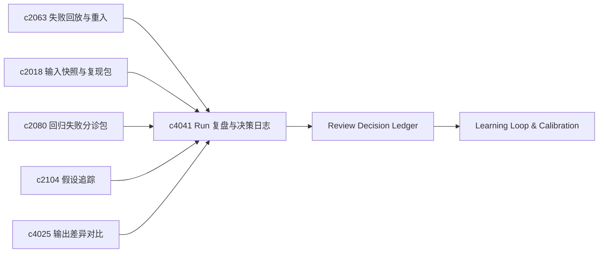

## Why

一次 run 结束后，用户不仅关心结果，也关心为何顺利或卡住、下次是否换做法；若 run 结束即散，难以形成个人使用上的学习回路。协作变多时，团队易丢的不是内容，而是**当时为何如此判定**：若 review、退回、批准、忽略只散落在评论里，同样争议会反复出现——需将判断沉淀为**可追溯的决策记忆**。若系统持续给出建议、路由与自动化，却从不根据审阅结果、审批、使用与成本回流学习，则难以从"会动"变为"会变聪明"。与此同时，研究里最耐久的往往是「当时为何如此判断、后来又因何而改」——若转折未被单独记录，日久只剩结果、不见判断脉络。将 **执行复盘** 与 **决策日志** 放在同一条「运行反思」轴线上，才能把单次经验升级为可挂接假设、版本与主张地图的正式判断史，且保持 journal 轻量、不致沦为沉重手工文档。

> 合并说明：本提案合并了原 `decision-journals-and-why-it-changed`、`review-memory-and-decision-ledger`（含 `learning-loop-from-review-and-usage-signals`）的全部内容。

## 公共合成焦点

**Postmortem** 与 **decision journal** 都回答「为何如此」，但粒度不同：前者锚定单次 run 的执行结构（步骤、阻塞、代价、结果质量）并通向可操作的**建议回路**；后者锚定跨时间的判断史（采纳/放弃方案、why-it-changed）。合成要求是：复盘发现可**晋升为**正式决策节点，而不是与 journal 重复记账；假设演化、版本差异与主张地图应能挂到同一条时间线上，用户既能改操作，也能追溯「当时依据何在、后来因何而改」。

## 一体化原则（公共项收口）

1. **对象分轨、链路可串**：postmortem 必锚定 `run_id` 与阶段 timings；journal 条目可引用多个 run、假设状态与输出版本 diff，但二者通过显式「升级链接」关联，避免同一转折记两遍。
2. **建议 vs 决策**：recommendation loop 产出候选动作；仅当用户确认或策略规则命中时，才生成带 why-it-changed 的正式决策节点。
3. **轻量优先**：journal 字段以可选标签 + 短摘要为主，长文附录走现有输出/版本产物，不另起一套文档编辑器。
4. **回放同源**：失败回放、分诊包与版本复核读取与 postmortem/journal 相同的关联字段，保证时间线视图一处渲染。

## What Changes

1. **Run 复盘摘要**：定义 run postmortem summary，覆盖关键步骤、阻塞点、代价与结果质量；支持挂回模板、来源包与长线线程，而非仅单次 run 历史。
2. **建议回路**：定义 recommendation loop，将经验沉淀为下次可采纳建议；区分「建议用户改操作」与「建议系统改默认值」两类后续动作。
3. **决策日志**：定义 decision journal，记录关键判断、采用方案与放弃路线；增加 why-it-changed 语义，标明证据变化、范围变化或表达策略变化等转向原因。
4. **挂接与升级**：决策记录可挂接线程、假设、输出版本与主张地图；复盘结果可升级为正式决策记录；假设演化可沉淀为决策节点；版本复核可查看背后的决策变化。
5. **体验边界**：journal 偏轻量、可回看，不追求完整企业级文档流程。
6. **审阅决策账本（review memory & decision ledger）**：引入 decision ledger，将审阅意见、批准原因、风险接受、例外与发布备注结构化为记录；review note 可抽成可复用 decision pattern（如某类来源须二次核查、某类说法不可直发）；按 artifact、workspace、审批请求、来源类型与时间线回看关键判断。
7. **学习与策略校准闭环（learning loop from review & usage）**：建立 learning loop，汇总 review、审批、使用行为、版本表现与成本为可学习反馈；支持对 prompt preset、推荐动作、模型路由、briefing 形态与模板效果持续校准；提供"为何如此建议/路由"的反馈可解释摘要。

## Capabilities

### New Capabilities

- `run-postmortem-summaries-and-recommendation-loops`：执行复盘摘要、建议回路与经验沉淀入口。
- `decision-journals-and-why-it-changed`：关键决策记录与判断变化缘由。
- `review-memory-and-decision-ledger`：结构化决策记录、例外理由、复用规则与历史回看。
- `learning-loop-from-review-and-usage`：反馈采集、效果归因、策略校准与可解释学习。

### Modified Capabilities

- `research-run-failure-replay-and-step-reentry`：回放页承接复盘视角。
- `run-input-snapshots-and-repro-packs`：输入快照作为复盘证据包（`c2018`）。
- `regression-failure-triage-bundles-and-shareable-reports`：分诊包可复用 run 复盘内容。
- `hypothesis-tracking-and-verdict-evolution`：假设演化沉淀为决策节点。
- `output-diff-compare-and-version-review`：版本复核可查看背后决策变化。
- `evidence-review-workflow`：review note 扩展为可沉淀、可追溯、可复用的决策对象。
- `quality-gates-for-generation`：质量异常与人工通过/退回纳入质量门与学习反馈。
- `publishable-artifacts`：产物页可查看历史决策上下文。
- `quality-and-regression`：结合真实使用与审阅做持续效果回看。
- `generation-observability-and-guardrails`：暴露可供学习系统消费的行为、成本与失败信号。

## Impact

- **Backend**：run summary、建议生成、经验索引；决策对象、变更原因与关联索引。
- **Frontend**：run 结束页、历史详情、模板优化提示；线程页、版本页、决策时间线。
- **Dependencies**：接在 `c2063`、`c2018`、`c2080` 之后，将单次执行变为长期可学习对象；并承接 `c2104`、`c4025`，把「结果变化」补全为「判断变化」。

## Dependency Sketch

