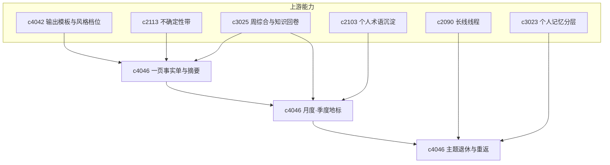

## Why

并不是每次都需要完整长文：用户常想把主题压成一页事实单或单页摘要，用于回看、对比与推进；周综合适合短期节奏，但更长跨度的主题需要月度「地标」与季度鸟瞰，否则长期研究缺少阶段感；同时并非每个主题都应永久活跃——有些应带着总结与线索冷存，隔很久又要能最短路径重返。轻产物、时间尺度的知识导航与主题生命周期管理，应作为同一套「知识地标」能力统一设计，避免轻摘要、月度层与退场/重返各自为政。

> 合并说明：本提案合并了原 `monthly-domain-briefs-and-knowledge-landmarks`、`theme-retirement-and-cold-reentry-paths` 的全部内容。

## 公共合成焦点

三条子线共享同一套「可导航的轻量表征」与证据语义：**单页摘要**提供微观入口；**月度 brief / 地标与季度 atlas**提供中观到宏观的阶段坐标；**主题退休与冷重返**定义生命周期边界与最小捡回路径。产物层统一复用主张—证据—不确定性，避免为「短摘要」「月报」「冷存」各造一套弱化叙事；索引与 UI 上应能连贯地从「正在推进」走到「阶段封存」，再走到「带着地标与线索重返」，而不依赖隐藏或删除线程。

## 一体化原则（公共项收口）

1. **证据同源**：fact sheet、月度 brief、季度 atlas、退休摘要与重返包引用同一套主张—证据—不确定性绑定，禁止为「更短」再生成一套弱证据叙事。
2. **时间刻度嵌套**：周综合可上卷为月度地标输入；月度可聚合为季度 atlas；退休动作必须写入可机读指针（最近地标、未决问题、恢复线索），而非仅打标签。
3. **导航不增熵**：列表与回顾页用统一「地标卡片」模式展示（阶段结论、术语稳定点、转向原因），避免月报体例与摘要体例两套 UI 方言。
4. **冷存非删除**：退休主题仍在检索与记忆中可达，默认过滤为「活跃」，但重返路径与地标搜索必须命中冷存实体。

## What Changes

1. **轻量输出形态**：定义 fact sheet 与 one-page abstract；复用同一套主张、证据与不确定性表达；可作为长线线程、问题线程与周综合的摘要封面；区分「研究内摘要」与「对外展示摘要」，优先个人回看与推进。
2. **月度与季度知识导航**：定义 monthly domain brief，汇总某主题域一月内主要变化与新认识；定义 knowledge landmark，标出阶段性结论、术语稳定点与关键转向；定义 quarterly knowledge atlas 与 domain shifts（多主题域长期重心变化、概念升温/问题退潮/判断结构性转向），与主题图、月度摘要、术语沉淀互通，偏回顾与导航，避免夸张大图谱；强调保留真实认知地标，避免空洞月报。
3. **挂接与索引**：月度摘要回挂长线线程、主题图与轻量摘要产物；术语稳定点进入地标；一页摘要可作为月度封面。
4. **主题生命周期**：定义 theme retirement（带阶段总结、遗留问题与恢复线索进入冷存）；定义 cold re-entry path（重新激活时的最短重返路径）；退休主题保留线程、地标与决策脉络，而非简单隐藏；退场为主动整理，不等同于遗忘或删除。
5. **跨层一致性**：记忆层区分活跃与冷存主题；长线线程支持进入退休阶段；月度地标作为主题重返入口之一。

## Capabilities

### New Capabilities

- `output-fact-sheets-and-one-page-abstracts`：一页事实单与单页摘要产物。
- `monthly-domain-briefs-and-knowledge-landmarks`：月度主题摘要与知识地标。
- `quarterly-knowledge-atlas-and-domain-shifts`：季度知识图集与领域重心偏移。
- `theme-retirement-and-cold-reentry-paths`：主题退休、冷存与冷启动重返路径。

### Modified Capabilities

- `output-composition-templates-and-layout-guards`：模板层支持轻量摘要产物。
- `uncertainty-bands-and-answer-confidence-shaping`：单页摘要保留不确定性表达。
- `weekly-synthesis-and-personal-knowledge-rollups`：周综合汇聚月度层，并引用轻产物。
- `cross-thread-theme-maps-and-subtopic-lattices`：主题图在季度层可回看（`c2106`）。
- `personal-glossary-growth-and-term-settling`：术语稳定点进入地标。
- `long-arc-threads-and-milestone-checkpoints`：长线线程支持退休阶段。
- `personal-memory-layers-and-recall-views`：记忆层区分活跃与冷存主题。

## Impact

- **Backend**：轻量输出装配、模板映射、摘要元数据；月度/季度聚合与地标索引；主题生命周期、冷存索引与重返摘要。
- **Frontend**：输出列表、摘要查看器、快速导出；主题域页、回顾页、长期地标视图；主题列表、回看页与恢复入口。
- **Dependencies**：承接 `c4042`、`c2113`、`c3025`（轻产物与周综合）；`c3025`、`c2103` 与轻产物链上的月度/季度层；`c2090`、`c3023` 与月度地标之上的主题退场与重返。

## Dependency Sketch

