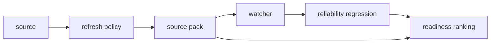

## Why

`c2001`、`c2051`、`c2058`、`c4050`、`c4053` 实际上都在描述同一条来源生命周期：来源接入后先判断“能不能用”，再决定“要不要刷新”，再把来源按主题打包维护，最后进入长期监测与退化治理。

如果把这些能力拆成多个独立 change，后面很容易出现边界漂移：refresh policy 不知道该挂在 source 还是 pack，watcher 不知道该复用 freshness 还是另起状态，可靠性退化信号也会变成孤立告警。合并后可以把来源从“单次接入对象”收口成“可维护、可比较、可监测的长期资产”。

## Merge Notes

- 合并自 `source-readiness-and-freshness-hub`
- 合并自 `source-refresh-policy-profiles-and-auto-recheck`
- 合并自 `source-pack-assembly-and-topic-watchlists`
- 合并自 `long-running-watchers-and-delta-refresh-briefs`
- 合并自 `source-reliability-regressions-and-watch-flags`
- 合并自 `source-remediation-queues-and-bulk-fixes`

## What Changes

- 收口来源健康与就绪语义：
  - 统一 `source` / `source pack` / `watcher` 三层对象的 readiness、freshness、异常提示与下一步动作
  - 让“现在能不能用、该不该刷新、为什么建议这样做”成为同一套可解释信号
- 把 refresh policy 纳入正式生命周期：
  - 定义 refresh policy profile 与 auto recheck，不再把复查逻辑埋在后台规则里
  - 区分头信息复查、摘要变化复查、全量重抓，并允许人工覆盖
- 把来源包升级为长期维护单元：
  - source pack 负责主题级装配、refresh diff、refresh brief、横向 comparison 与 readiness ranking
  - watchlist 不再是孤立标签，而是 watcher/monitor 的输入来源
- 把长期 watcher 与来源退化治理并为一条线：
  - watcher 记录触发原因、运行状态、delta brief 与历史时间线
  - reliability regression / watch flag 成为 watcher 可消费的长期信号，并驱动重抓、补抓和阅读重排建议
- 增加来源修复队列与批量修复（source remediation）：
  - remediation queue 把来源异常按可执行动作收口（重试提取、重新绑定、补标签、隔离、归档或批量重抓）
  - 按 connector、owner、异常类型、敏感等级和影响范围筛选待修复项
  - bulk fix preview 先看影响再确认执行，避免批量改坏
  - 修复结果回写 freshness、搜索可见性、review 风险和权限限制
- 明确 UI 与调度边界：
  - Sources / Source Pack / Watcher 入口共享同一套状态分层、恢复动作与历史查看方式
  - background jobs 需要支持周期复查、事件触发、暂停恢复与失败重试

## Capabilities

### New Capabilities

- `source-readiness-and-freshness`: 定义来源、来源包与长期监测对象的可用性、新鲜度和再同步信号。
- `source-refresh-policy-profiles-and-auto-recheck`: 定义来源刷新档位、自动复查与策略解释语义。
- `source-pack-assembly-and-topic-watchlists`: 定义来源包、主题观察列表和集合级操作语义。
- `source-pack-refresh-diff-and-brief`: 定义来源包刷新差异、变化摘要和重读建议。
- `source-bundle-comparisons-and-readiness-rankings`: 定义来源包横向比较和就绪度排序。
- `long-running-watchers-and-delta-refresh-briefs`: 定义长期 watcher、触发/状态与 delta refresh brief。
- `recurring-monitors-and-delta-briefings`: 定义持续监测对象、交付偏好与历史时间线。
- `source-reliability-regressions-and-watch-flags`: 定义来源可靠性退化、观察标记与趋势性风险信号。
- `source-remediation-and-bulk-fixes`: 来源修复队列、批处理预览、执行回执和修复结果语义。

### Modified Capabilities

- `source-ingestion-core`: 需要暴露更细的 readiness、freshness 与失败恢复语义。
- `knowledge-curation-and-freshness`: freshness 需要从 source 扩展到 source pack / watcher 维度。
- `workspace-api-contract`: 需要增加 source pack、watcher、refresh diff 与 watch flag 接口。
- `workspace-ui-panels`: Sources 面板需要承载来源健康、来源包比较、watcher 入口和恢复动作。
- `background-jobs-and-task-runtime`: 需要支持轻量复查、周期任务、事件触发任务与暂停恢复。
- `source-coverage-and-evidence-map`: 覆盖图需要支持来源包与 refresh diff 背景。
- `search-index-incremental-refresh-and-staleness-diagnostics`: 增量刷新需要暴露足够的来源变化上下文。
- `output-diff-compare-and-version-review`: 输出对比需要能引用来源包 refresh brief。
- `reading-queue-prioritization-and-guided-order`: 阅读队列需要消费来源包 readiness ranking 与 watch flag。
- `source-trust-signals-and-quality-hints`: 可信信号需要增加时间趋势与退化观察面。
- `targeted-recapture-for-broken-or-thin-sources`: 退化来源需要优先进入修复或替代路径。
- `source-connectors`: 需要暴露可重试、可重绑、可同步和不可恢复异常的稳定动作面。
- `dlp-redaction-and-sensitive-data-guards`: 敏感命中来源接入隔离和修复工作流。

## Impact

- Backend：来源对象模型、refresh policy 存储、source pack 计算、watcher 调度、趋势分析与 delta brief 持久化会收口成一条生命周期链。
- Frontend：来源详情、来源包页、watcher 入口和“本次变化”视图会共享同一套状态解释与恢复动作。
- Product：来源不再只是“导入完就结束”，而是可以持续维护、持续比较、持续监测的长期资产。

## Dependency Sketch

