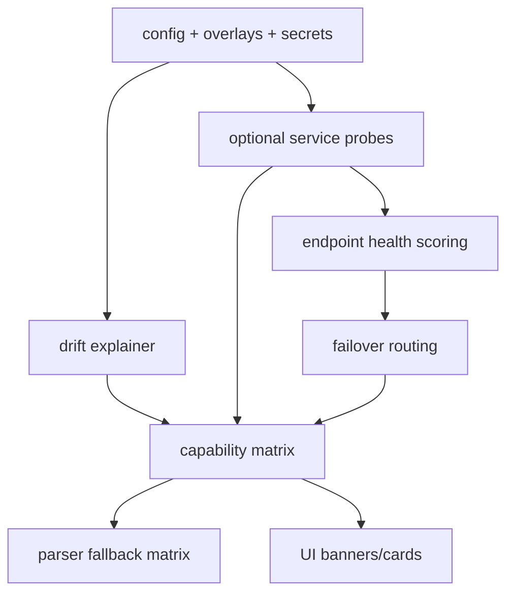

## Why

`c1000` 解决“配置是怎么被装出来的”，`c2153` 解决“这份配置最终让系统具备哪些能力、哪些在降级、为什么”。两者拆开后，profile、optional service、drift explainer、degraded mode 会反复引用同一批概念，但没有一个统一入口解释“当前环境到底在运行什么、缺了什么、下一步怎么修”。

合并后可以把这条链收口成同一个配置与能力契约：

- 静态层：配置来源、overlay 顺序、schema/drift guard、effective config
- 运行时层：optional services readiness、profile capability matrix、parser fallback、degraded mode explainer

## Merge Notes

- 合并自 `config-profile-overlays-and-drift-guards`
- 合并自 `profile-capability-matrix-and-degraded-mode-explainer`
- 合并自 `model-endpoint-health-scoring-and-failover-routing`

## What Changes

- 把配置来源、overlay 顺序与 schema validate 写成稳定契约：
  - `config/app.yaml`、overlay、`secret.env` 与配置定位变量的边界固定
  - 暴露 redacted effective config，并给出 drift guard / drift explainer
- 把 profile 变成能力契约，而不是部署口头约定：
  - local / hybrid / docker / full 的能力边界、默认插件/功能集与成本约束明确化
  - static config diff 与 runtime derived diff 区分表达，避免排障时把两类问题混在一起
- 把 optional services readiness 做成一等对象：
  - 统一字段：enabled、endpoint candidates、last_probe、status、error_code、hint、next_action、degraded_mode
  - probe 策略必须非阻塞、可缓存、可限频
- 增加 capability matrix + degraded mode explainer：
  - 以 profile + settings + optional services readiness 为输入
  - 产出 `available / degraded / unavailable` + `reason_code` + `next_action`
  - 明确什么允许降级、什么必须 hard fail
- 增加 parser capability matrix 与 format fallbacks：
  - 让导入/转换失败不再只剩“怪怪的”，而是明确结构保真、文本保真与元数据保真差异
- 定义模型端点健康评分与故障切换路由（endpoint health scoring & failover routing）：
  - endpoint health model：last_success_at/last_failure_at、recent_success_rate（滚动窗口）、p50/p95 latency、cooldown_until
  - failover routing：按 order_endpoint_candidates 默认优先级叠加 health score，把"最近稳定"排到前面；按 service_key 独立评分
  - 统一 probe/观测入口：readiness monitor 复用健康模型，上游 http client 复用失败/延迟统计
  - 暴露解释面：状态接口返回当前选中端点、选择原因、备用候选情况；前端诊断可看切换时间与前后对比
  - picker/override + UI 闭环：可解释 endpoint 状态接口、pin/unpin override、一键 probe、切换事件追溯
- 收口 config rationale journal 与 safe default audit：
  - 关键配置项要说明为什么存在、什么时候需要重审
  - drift explainer 可引用 rationale，让变更更可解释

## Capabilities

### New Capabilities

- `config-profile-overlays`: 配置层级、profile、effective config 与 overlay 顺序契约。
- `config-profile-diff-and-drift-explainer`: 配置档位差异、漂移解释与预检输出语义。
- `config-rationale-journal-and-safe-default-audits`: 配置理由日志、默认值审计与迁移复核规则。
- `optional-services-readiness-contract`: 定义可选服务状态、探测、降级与恢复动作契约。
- `profile-capability-matrix-and-degraded-mode-explainer`: 定义 profile 级能力矩阵与降级解释语义。
- `parser-capability-matrix-and-format-fallbacks`: 定义解析器能力矩阵、格式回退与保真度说明。
- `model-endpoint-health-scoring-and-failover-routing`: 定义端点健康评分、failover 路由与可解释输出。
- `model-endpoint-picker-and-health-explainer-ui`: endpoint 状态解释接口、override 契约与诊断 UI。

### Modified Capabilities

- `config-and-models`: Settings/Config 字段语义、默认值、敏感字段与 optional service schema 需要收口。
- `service-composition-profiles`: profile 的能力边界、optional subservice 状态与 endpoints 选择规则需要可解释。
- `delivery-and-deployment`: drift gate、自托管诊断入口与 profile 默认开关需要统一。
- `workspace-api-contract`: capability/status/error/correlation 输出需要稳定。
- `workspace-ui-core`: degraded banner、恢复动作与 capability 卡片需要有最小契约。
- `workspace-home-and-operating-cockpit`: 首页/驾驶舱需要消费 capability matrix。
- `source-ingestion-core`: 解析回退和保真度要写回来源状态。
- `source-ingestion-summary-and-conversion`: 需要表达解析保真与 fallback 结果。
- `retrieval-and-cache`: 降级状态下的检索/缓存行为必须标注 fallback 与影响范围。
- `vector-store-contract-and-provider-parity`: provider 差异需要能被矩阵解释。
- `http-client-pooling-and-upstream-timeout-policy`: 上游失败与时延需要回写到健康评分。
- `dev-diagnostics-workbench-and-state-dumps`: 诊断工作台需要能看到端点健康与切换记录。
- `observability-bundle-and-traceability`: 端点切换应能被诊断包捕获。

## Impact

- Backend：配置加载、探活缓存、能力求值、reason code 与 next action 会统一到一条链路。
- Frontend：用户能直接看到“现在能做什么、受什么影响、为什么会降级、下一步怎么修”。
- Ops：profile 切换、部署预检与 drift 排障会更稳定，不再靠经验判断。

## Dependency Sketch

