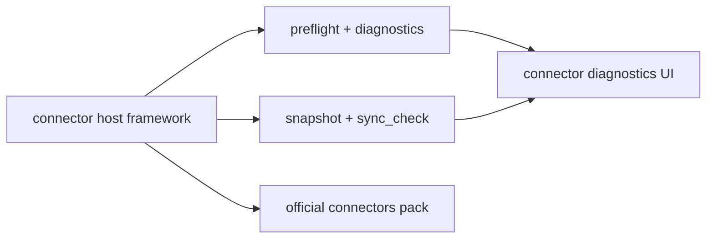

## Why

`c4055` 定义了 connector host 的框架边界与诊断语义，`c4028` 则提出用一组高覆盖官方 connectors 验证这套框架是不是可复用、可扩展、能处理 secrets 与增量同步。两者本质上是一件事：如果没有落地 pack，framework 很容易停留在抽象；如果没有统一 framework，plugin pack 又会把宿主 UI 和错误语义做散。

合并后更合理的表述是：

- 宿主先定义 connector binding / preflight / snapshot / sync_check / diagnostics 的稳定合同
- 官方 plugins pack 用多形态 connector 去验证这套合同

## Merge Notes

- 合并自 `source-connectors-preflight-and-sync-diagnostics`
- 合并自 `source-connector-plugins-pack`

## What Changes

- 定义 `SourceConnectorPlugin` 框架边界：
  - binding、preflight、snapshot、sync_check、fetch、import_scope、confirm_import、dry-run
  - 宿主负责通用任务流、diagnostics UI、error_code、diagnostics export
- 定义 connector preflight 与 sync diagnostics：
  - config schema、连接可达性、样本拉取、optional service readiness
  - `READY / DEGRADED / BLOCKED` 状态与 `error_code / hint / next_action`
  - `snapshot_id` 作为 sync baseline，sync_check 输出 added / modified / deleted + reason
- 定义 connector diagnostics UI 与恢复提示：
  - 已绑定/未绑定、上次同步、最近错误、当前 readiness、恢复动作
  - 可导出最小诊断包，不含敏感正文
- 在 framework 之上落地官方 source connectors pack：
  - `local-directory`
  - `obsidian-vault`
  - `rss/atom`
  - `imap-email`
- 用 plugins pack 验证四类典型问题：
  - 文件仓 / 链接图 / frontmatter
  - URL/feed 增量与 canonicalization
  - secrets/redaction
  - dry-run、预估、部分成功与失败恢复

## Capabilities

### New Capabilities

- `source-connectors-framework`: 连接器插件契约、宿主通用流程与 UI 边界。
- `source-connectors-preflight-and-sync-diagnostics`: 定义 preflight、诊断分层与同步前检查契约。
- `connector-sync-check-diff-and-snapshot-semantics`: 定义 sync_check diff 输出与 snapshot baseline 语义。
- `connector-diagnostics-ui-and-recovery-hints`: 定义连接器诊断 UI、恢复提示与诊断包导出。
- `local-directory-source-connector-plugin`: 定义本地目录 connector 的最小可用能力。
- `obsidian-vault-source-connector-plugin`: 定义 Obsidian Vault connector 的最小可用能力。
- `rss-source-connector-plugin`: 定义 RSS/Atom connector 的最小可用能力。
- `imap-email-source-connector-plugin`: 定义 IMAP email connector 的最小可用能力。

### Modified Capabilities

- `source-connectors`: 宿主需要稳定提供 notebook-scoped binding、snapshot-first、显式 sync_check 与 diagnostics。
- `official-plugins`: 官方 connector 需要进入 catalog、安装提示与 diagnostics 体系。
- `workspace-api-contract`: connector 列表、binding、diff、diagnostics 与 error 输出需要稳定。
- `workspace-ui-panels`: 来源面板要能承载 connector host UI 与恢复动作。
- `source-ingestion-upload-and-url`: connector 导入需要接入批量导入与 URL source 流程。
- `source-deduplication-and-canonicalization-pipeline`: RSS/URL 导入要走 canonicalization。
- `extractor-fallback-chain-and-capture-provenance`: URL/feed 导入要说明提取 provenance 与 fallback。
- `tool-config-secrets-and-redaction`: connector secrets 存储、日志与诊断包要默认脱敏。
- `structured-logging-schema-redaction-and-error-sampling`: connector 链路不能泄露敏感字段。
- `error-code-registry-and-api-error-shape-enforcement`: connector 恢复提示需要统一错误码。

## Impact

- Backend：connector host、diagnostics 模型、snapshot baseline 与 4 个官方 connectors 会一起落地，减少后续重复造壳。
- Frontend：来源接入更像统一插件入口，而不是每个 connector 自带半套 UI。
- Product：失败路径会明显更清楚，新增 connector 的成本也会更可控。

## Dependency Sketch

