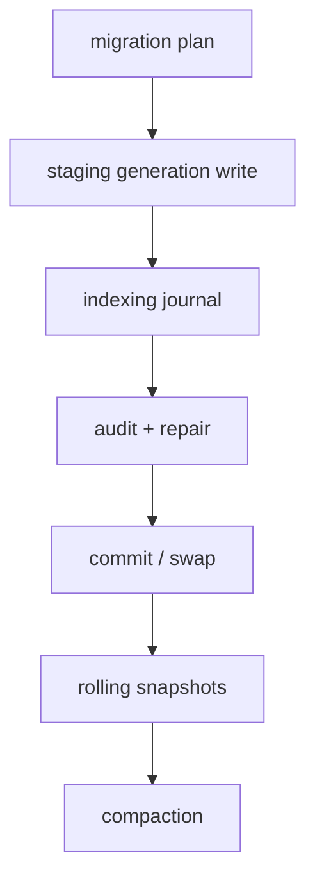

## Why

`c1047`、`c1049`、`c4056` 实际上都在处理同一条向量索引生命周期：先把新向量写进 staging，确认它们和预期 chunk 集合一致，再以可回滚、可续跑、可压缩的方式切换 active generation。拆成三条 change 时，migration、atomicity、journal 会互相引用，但没有一条主线明确“这次索引变更是如何被写入、验证、提交、恢复与清理的”。

合并后这条主线会更清楚：

- migration 负责计划、metadata 与一致性审计
- atomicity 负责 staging/commit、tombstone、rolling snapshots 与 compaction
- journal 负责进度、可续跑、失败恢复与版本摘要

## Merge Notes

- 合并自 `embedding-model-upgrades-and-safe-vector-migrations`
- 合并自 `vector-write-atomicity-tombstones-and-compaction`
- 合并自 `indexing-journal-and-resumable-backfills`

## What Changes

- 定义 embedding/vector migration plan：
  - 新模型 id、维度、迁移范围、预估成本、回滚窗口
  - 写入统一进入 staging generation，完成审计后再 swap
- 收口 metadata 与 drift semantics：
  - `index_generation_id`、`embedding_model_id`、`embedding_dim`、`chunk_hash`、`embedded_at`
  - 可选记录 parser/chunking 版本，便于解释 drift
- 定义 vector write atomicity：
  - 写入先进入 staging；未提交写入不可见
  - 删除/替换通过 tombstone 表达，而不是立即物理删除
  - commit 之后再切 active generation，避免短暂空洞与混合态
- 定义 rolling snapshots + time-travel debug：
  - 保留有限历史 generations
  - 支持 debug pin 到历史 generation，并生成 generation diff
- 定义 indexing journal + resumable backfills：
  - 记录 parse/chunk/embed/upsert/verify/swap 阶段、版本摘要、失败分类与 recovery hint
  - 允许在版本摘要一致时从中间阶段继续
- 定义一致性审计、repair jobs 与 compaction：
  - missing / orphan / drifted 三类缺口
  - missing/drifted 进入 backfill/re-embed，orphan/tombstone 进入 dry-run cleanup
  - compaction 属于可暂停、可恢复、可解释的 maintenance lane

## Capabilities

### New Capabilities

- `embedding-model-upgrades-and-safe-vector-migrations`: 定义向量迁移计划、staging 迁移与回滚边界。
- `vector-entry-metadata-v2-and-drift-detection`: 定义向量条目元数据与 drift 识别语义。
- `vector-index-consistency-audits-and-repair-jobs`: 定义审计、缺口分类与修复任务。
- `rolling-index-snapshots-and-time-travel-debug`: 定义滚动索引快照、历史 pin 与 generation diff。
- `vector-write-atomicity-tombstones-and-compaction`: 定义 staging/commit、tombstone 与 compaction 语义。
- `indexing-journal-and-resumable-backfills`: 定义索引 journal、续跑与幂等写入边界。

### Modified Capabilities

- `retrieval-and-cache`: generation/epoch 变化需要有明确失效与调试解释。
- `generation-observability-and-guardrails`: 索引阶段耗时、失败分类与恢复动作需要可观察。
- `workspace-api-contract`: 需要稳定暴露 migration/journal/status/repair 概要。
- `background-jobs-and-task-runtime`: index build / compaction / repair 需要复用长任务语义。

## Impact

- Backend：向量索引将从“直接 CRUD”升级为“有 generation、有 journal、有提交点”的写路径。
- Frontend：诊断面可以直接解释“为什么还没切新索引、哪一步失败、能不能续跑、能不能回滚”。
- Operations：迁移、修复和清理都会更可审计，但复杂度也会上升，所以必须保留硬上限与 dry-run。

## Dependency Sketch

