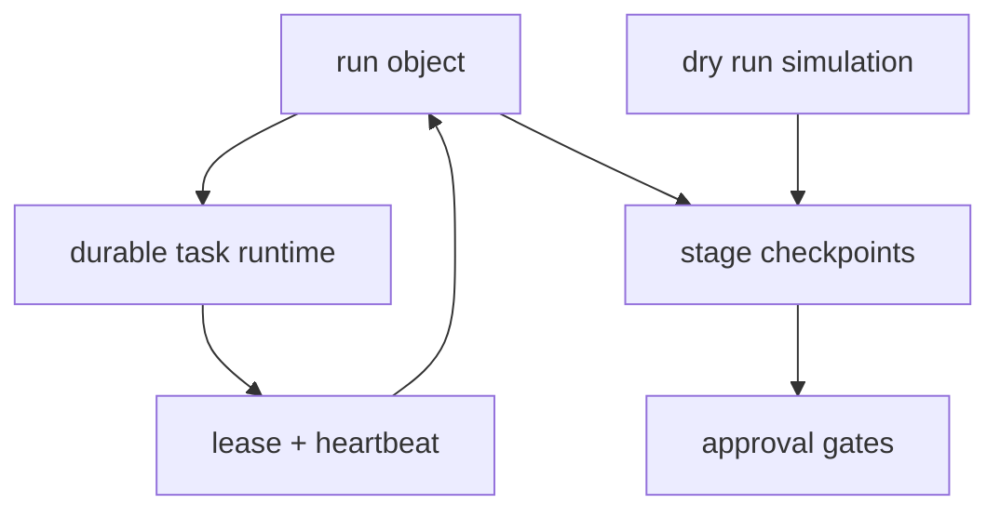

## Why

`c2008` 负责统一 run 对象和取消/恢复语义，`c2151` 负责 worker lease、restart reconciliation 与 durable queue，`c4040` 负责把 run 切成用户可理解的阶段并引入 approval gate。这三条其实是在描述一条连续执行链：一个 run 如何被创建、如何执行、如何在重启后继续对账、以及如何在关键阶段暂停/继续/模拟。

如果拆开推进，会导致三个问题：

- lifecycle 和 durability 各自有状态机，难以对齐
- approval gate 不知道该挂在 run 还是 task 上
- restart reconciliation 不知道如何处理 checkpoint/gate 中断态

## Merge Notes

- 合并自 `run-lifecycle-and-cancellation-contract`
- 合并自 `task-runtime-durability-and-restart-reconciliation`
- 合并自 `run-stage-checkpoints-and-approval-gates`
- 合并自 `task-feed-compaction-and-event-timeline`

## What Changes

- 定义 `Run` 作为一等对象：
  - `id`、`type`、`status`、timestamps、上下文绑定、统一查询/流式接口
  - 明确用户可见状态与内部阶段状态之间的映射
- 收口 cancellation / resumption / orphan cleanup：
  - 区分用户取消、系统回收、异常中断
  - 定义 resume、requeue、orphan cleanup 的边界与恢复说明
- 定义 durable task runtime：
  - worker lease / heartbeat / stuck job detection
  - DB claim queue、retry policy、restart reconciliation
  - 启动时扫描 lease 过期的运行中任务并给出恢复路径
- 定义 run stage checkpoints 与 approval gates：
  - 在关键阶段可暂停、确认、回退、换模板、补来源
  - 支持自动通过与手动拦截两种模式
- 增加 run plan dry run + simulation：
  - 在正式执行前模拟 run 路径、输入掉落和高风险阶段
  - dry run 可直接回接 stage gate 和恢复动作
- 定义 task feed compaction 与 event timeline：
  - 把高频内部事件收成稳定的阶段节点和摘要事件
  - 让任务、research run、来源同步和输出生成都能投到同一种时间线语义
  - 区分用户需要看的事件、调试事件和审计事件
  - 时间线天然支持回放、定位失败点、回跳相关对象与恢复入口
- 定义 failure replay 与 step re-entry：
  - 明确哪些阶段可以重放、哪些只能重建
  - 为 replay 记录输入快照、上下文摘要和关键参数
  - 支持从失败步骤、人工检查点或指定阶段重新进入
  - 区分可恢复失败、需人工修正失败和不可重放失败

## Capabilities

### New Capabilities

- `run-lifecycle-contract`: Run 生命周期、状态机、接口与幂等/取消语义。
- `task-cancellation-resumption-and-orphan-cleanup`: 取消、恢复与孤儿任务清理语义。
- `task-runtime-durability-and-restart-reconciliation`: 定义任务租约、DB 抢占、重启对账与重试策略。
- `worker-health-heartbeats-and-stuck-job-detection`: 定义 worker 心跳、卡死判断与恢复动作。
- `run-stage-checkpoints-and-approval-gates`: 定义阶段检查点、继续条件与人工确认门。
- `run-plan-dry-run-and-simulation`: 定义执行前模拟、风险预估与步骤预演。
- `task-feed-compaction-and-event-timeline`: 任务事件压缩、阶段时间线和多视图事件分层。
- `research-run-failure-replay-and-step-reentry`: 失败回放、步骤重入和恢复边界。

### Modified Capabilities

- `background-jobs-and-task-runtime`: run 与 task 的映射、attempt 历史、取消/重试与历史查询需要统一。
- `generation-observability-and-guardrails`: run stages、卡死检测与取消边界需要可观察。
- `workspace-api-contract`: run 查询、cancel、stream、stage gate 与 simulation 的输出需要稳定。
- `workspace-ui-panels`: UI 需要稳定展示 run 状态、阶段、恢复动作与审批入口。

## Impact

- Backend：run orchestration、task runtime、restart recovery 和 stage gate 会统一到一套执行语义里。
- Frontend：run 面板、任务中心、继续/取消/重试/审批入口可以复用，而不是每条长链路单做状态机。
- Product：用户会更容易理解“刚才那次执行现在在哪里、为什么停了、能不能继续、继续之前我能不能先看一眼”。

## Dependency Sketch

