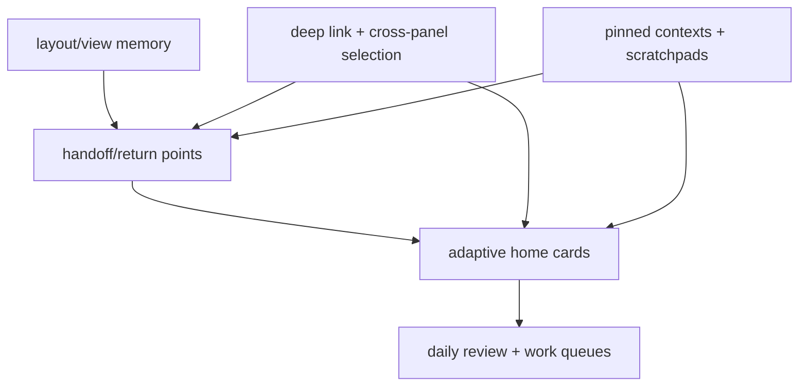

## Why

`c3008` 解决“回到工作区时布局和焦点如何恢复”，`c3011` 解决“中断后如何回到具体现场”，`c3012` 解决“回到首页先看什么”，`c3015` 解决“延后项和日常回看如何重新浮现”。它们共同描述的是同一件事：个人工作台如何在跨天、跨中断、跨面板的情况下持续保有工作连续性。

拆开看会有边界漂移：

- view memory 和 return points 会重复保存类似上下文
- home cards 和 daily review 会分别做优先级、回看与 resurfacing
- cross-panel deep link 与 continue work 入口如果不统一，恢复体验会碎裂

## Merge Notes

- 合并自 `workspace-layout-presets-and-view-memory`
- 合并自 `session-handoff-and-return-points`
- 合并自 `adaptive-home-cards-and-priority-collapse`
- 合并自 `daily-review-resurfacing-and-deferred-items`
- 合并自 `pinned-work-contexts-and-scratchpads`

## What Changes

- 定义 workspace continuity 基座：
  - layout presets、view memory、cross-panel selection、deep link、focus mode
  - handoff points 与 return points 共享同一套恢复对象模型
- 定义 home continuation surface：
  - adaptive home cards、priority collapse、pinned cards
  - 首页优先展示 return points、deferred items、work queues 与 next actions
- 定义 daily review / resurfacing / work queues：
  - 延后项回看、personal work queues、review buckets、activity heatmap、routine loops
  - 将“继续、延后、归档、回桶”变成正式动作，而不是只靠记忆
- 定义 pinned work contexts 与 scratchpads：
  - pinned work context：一键钉住当前对象组合（notebook、source、artifact、run），自动保存视图坐标
  - 支持多个 pin 组（类似浏览器 tab group），每组可命名，按工作流区分
  - pin 组与 return point 共享恢复入口
  - scratchpad：承载短笔记、待核查点和临时摘录，支持从 scratchpad 回写到正式对象
  - scratchpad 有过期策略，超过 N 天未触碰进入待清理状态
- 打通 continuity contract：
  - 从首页卡片、命令入口、URL deep link、搜索落点与面板跳转进入同一定位规则
  - 临时 focus mode 与长期 layout preference 严格分离，避免互相污染

## Capabilities

### New Capabilities

- `workspace-layout-presets-and-view-memory`: 定义布局预设、视图记忆和工作现场恢复语义。
- `workspace-focus-mode-and-distraction-pruning`: 定义专注模式、界面降噪和焦点恢复语义。
- `cross-panel-selection-and-deep-link-contract`: 定义跨面板选中、对象定位和深链跳转语义。
- `session-handoff-and-return-points`: 定义工作中断点、返回点和上下文恢复语义。
- `adaptive-home-cards-and-priority-collapse`: 定义首页卡片自适应排序、折叠和固定语义。
- `daily-review-resurfacing-and-deferred-items`: 定义延后项回看、重新浮现和每日复盘语义。
- `personal-work-queues-and-review-buckets`: 定义个人工作队列、复盘桶和对象流转语义。
- `workspace-activity-heatmap-and-routine-loops`: 定义活跃热力、重复工作节奏和自我管理信号。
- `pinned-work-contexts-and-scratchpads`: 定义固定工作上下文、临时草稿区和回写边界。

### Modified Capabilities

- `workspace-ui-core`: 顶层入口需要承接 continue work、focus mode、review 与 home prioritization。
- `workspace-shared-ui-state`: 需要稳定保存 layout、focus、return context 与部分 review state。
- `workspace-api-contract`: 需要支持 return point、work queue、home summary 与 deep link 恢复接口。
- `workspace-ui-panels`: 各面板要遵守同一套 selection/deep-link/return contract。

## Impact

- Frontend：workspace 壳层、home、panel navigation、focus mode 与 continue-work 入口会统一到底层 continuity contract。
- Backend：需要更稳定的 return context、queue summary、daily review 聚合与 home priority 输入。
- Product：长期使用体验会明显顺，用户回到现场时不必重新找上下文，也不容易丢掉被延后的事项。

## Dependency Sketch

