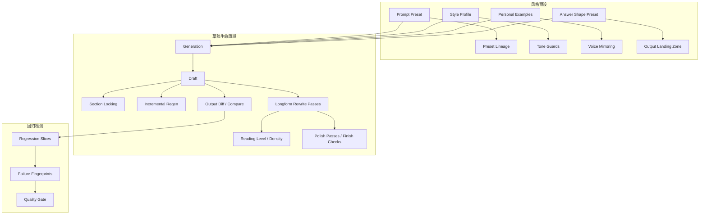

## Why

`c1006`、`c1027`、`c4025`、`c4042` 描述的是同一条输出控制闭环：先用 preset / style profile 定义期望，再通过 draft lifecycle 安全地重生成和局部修改，最后用 regression slices / failure fingerprints 检查这些改动是否把结果弄坏。拆开后，这些提案会在“preset 版本”“section style”“diff review”“regression gate”之间互相引用，但没有一个统一对象解释“这次输出为什么长这样、改了什么、会不会回归”。

## Merge Notes

- 合并自 `prompt-and-generation-presets-lineage-and-constraints`
- 合并自 `prompt-regression-slices-and-failure-fingerprints`
- 合并自 `output-draft-lifecycle-and-regeneration-safety`
- 合并自 `section-style-profiles-and-tone-guards`
- 合并自 `answer-shape-presets-and-output-landing-zones`
- 合并自 `longform-rewrite-passes-and-structural-refinement`

## What Changes

- 定义 generation preset / prompt preset 的版本化控制面：
  - schema、constraints、lineage、migration hints、effective controls
  - 记录 run/output 使用的 preset 版本
- 定义 answer shape preset 与 output landing zone：
  - 把常见回答形状（briefing、fact sheet、notebook、report）收成稳定档位
  - 明确某次 run 结果应该优先落到哪种输出形态
  - shape preset 受 goal contract、template 和不确定性带影响
  - landing zone 是引导而非强制，保留用户偏离自由
- 定义 output draft lifecycle：
  - draft / pending review / frozen / replaced 等状态
  - diff compare、version review、regeneration safety 与 incremental regeneration
- 定义 section style / tone / composition templates：
  - section style profile、tone guard、layout guard、personal style examples
  - 与 section locking、incremental regeneration 和 output templates 联动
- 定义长文重写与结构精修（longform rewrite passes & structural refinement）：
  - 把长文修订拆成结构重排、重复压缩、论证拉直、风格统一等几类 rewrite pass
  - structural refinement：在保留证据绑定前提下对整篇结构做较大幅度整理
  - reading level + density rewrites：把同一内容改写成不同阅读层级与信息密度（紧凑专业版 / 便于快速回顾版），保留主张与证据绑定
  - draft polish passes + finish checks：术语统一、重复消除、句子压实、脚注检查等小 pass，提供 finish check 清单
  - rewrite pass 与 section lock、citation queue 和 claim map 协同，避免改顺了结构却丢了证据
  - 区分"重写表达"和"重写逻辑"，精确控制改动强度
- 定义 regression loop：
  - prompt regression slices、failure fingerprints、版本迁移对比
  - preset/style/draft 变更必须能回接 regression evidence

## Capabilities

### New Capabilities

- `prompt-preset-lineage-and-migration`
- `generation-presets-and-constraints`
- `prompt-regression-slices-and-failure-fingerprints`
- `output-draft-lifecycle-and-regeneration-safety`
- `output-diff-compare-and-version-review`
- `output-section-locking-and-incremental-regeneration`
- `output-composition-templates-and-layout-guards`
- `section-style-profiles-and-tone-guards`
- `personal-style-examples-and-voice-mirroring`
- `answer-shape-presets-and-output-landing-zones`
- `longform-rewrite-passes-and-structural-refinement`
- `reading-level-and-density-rewrites`
- `draft-polish-passes-and-finish-checks`

### Modified Capabilities

- `chat-prompt-presets`
- `output-rendering-and-typing`
- `quality-and-regression`
- `workspace-api-contract`
- `workspace-shared-ui-state`
- `studio-output-types`
- `run-goal-contracts-and-success-checks`
- `output-fact-sheets-and-one-page-abstracts`
- `inline-citation-review-queue-and-fix-sweeps`: 引用复核需要在重写后自动进入扫尾。
- `claim-map-views-and-argument-tracebacks`: 主张地图需要辅助判断结构是否变得更清楚。
- `reading-packets-and-offline-review-bundles`: 审读包需要能选择不同密度版本。
- `evidence-appendix-autobuild-and-traceable-footnotes`: 收尾检查需要包含附录与脚注面。

## Impact

- Backend：preset registry、draft/version graph、style metadata、regression slices/fingerprints 会形成统一控制闭环。
- Frontend：preset 调整、章节风格、diff review、锁定重生成与回归提示会落到同一条输出工作流。
- Product：输出不再是“一次生成的快照”，而是可控、可回看、可比较、可迭代的对象。

## Dependency Sketch

