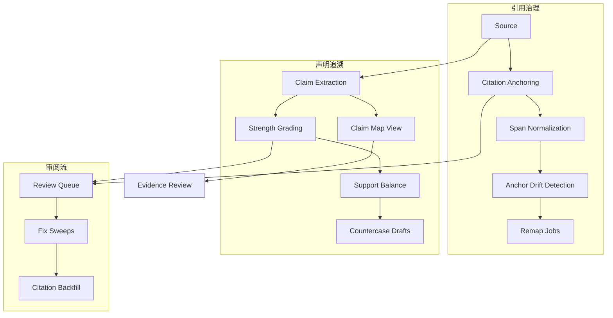

## Why

`c2034` 关注 citation locator、review queue 与 remap/backfill，`c2092` 关注 claim strength 和 evidence weight，`c2108` 关注把来源片段提炼成 claim candidates，`c2114` 关注 claim map 与 argument traceback。它们本质上都在回答同一个问题：从来源到主张再到最终输出，这条证据链能不能被稳定定位、比较强弱、进入复核，并能一路追溯回来。

## Merge Notes

- 合并自 `citation-quality-locator-v2-and-review-queue`
- 合并自 `claim-strength-grading-and-evidence-weight`
- 合并自 `source-to-claim-extraction-workbench`
- 合并自 `claim-map-views-and-argument-tracebacks`

## What Changes

- 定义 CitationV2 / locator / anchor confidence：
  - 强锚、弱锚、span normalization、source anchoring、hover proof、source highlights
  - drift detection、remap jobs、review queue、fix sweeps、backfill
- 定义 claim processing loop：
  - source-to-claim extraction workbench
  - claim strength grading、evidence weight、support balance、counterevidence quotas、pressure tests
- 定义 claim map / argument traceback：
  - 从最终段落回溯到 claim、evidence、source locator
  - 支持在审读与 review 中统一查看
- 打通 review workflow：
  - citation queue 与 claim review 不再分离
  - 低 confidence、弱证据、反证不足、anchor drift 都能进入统一修复与复核流

## Capabilities

### New Capabilities

- `citation-locator-v2-and-anchor-confidence`
- `inline-citation-review-queue-and-fix-sweeps`
- `citation-span-normalization-and-source-anchoring`
- `citation-backfill-and-missing-evidence-repair`
- `citation-anchor-drift-detection-and-remap-jobs`
- `citation-span-mapping-and-source-viewer-highlights`
- `claim-to-source-sidecars-and-hover-proofs`
- `source-segment-highlighting-and-inline-notes`
- `citation-context-batch-api-and-ui-prefetch`
- `claim-strength-grading-and-evidence-weight`
- `claim-support-balance-and-counterevidence-quotas`
- `argument-pressure-tests-and-countercase-drafts`
- `source-to-claim-extraction-workbench`
- `claim-map-views-and-argument-tracebacks`

### Modified Capabilities

- `evidence-review-workflow`
- `workspace-api-contract`
- `output-rendering-and-typing`
- `quality-and-regression`
- `source-aware-generation-modes`

## Impact

- Backend：citation locator、claim candidate、claim map、review queue 与 remap/backfill 会形成统一证据链模型。
- Frontend：用户可以从最终输出一路追到 claim、evidence 与 source，并对薄弱点做复核和修补。
- Product：证据感会从“有 citation”提升到“citation 能定位、claim 能分级、问题能持续修复”。

## Dependency Sketch

