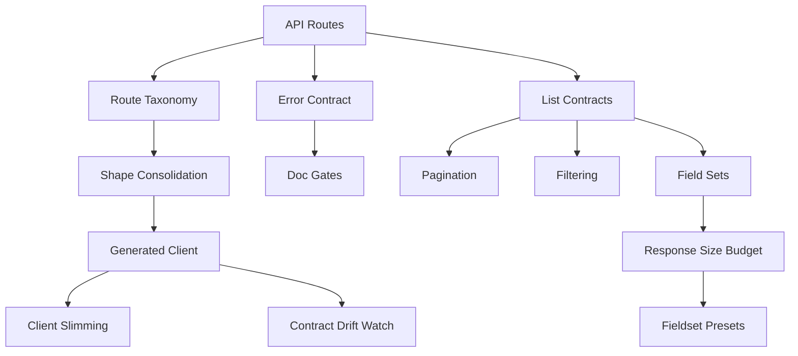

## Why

`c2041` 在收口 API shape，`c2160` 在收口错误契约，`c2165` 在定义 list contract，`c2229` 在整理 OpenAPI surface/taxonomy，`c2240` 在把 fieldsets 和响应体预算升级成性能契约。它们拆开看都成立，但本质上是在改同一层：**对外 API contract 与 generated client 的治理边界**。

如果继续分散推进，会出现三个问题：

- 同一组 endpoint 同时被 shape/list/error/taxonomy/budget 多头改写，规范容易互相打架。
- 前端 generated client 仍然要在 contract 不统一的前提下继续堆适配层。
- OpenAPI gate 只能局部生效，无法真正约束“新接口必须按统一 contract 出现”。

## Merge Notes

- 合并自 `api-shape-consolidation-and-generated-client-slimming`
- 合并自 `openapi-error-contract-and-doc-gates`
- 合并自 `api-list-contracts-pagination-filtering-and-field-sets`
- 合并自 `openapi-surface-cleanup-and-route-taxonomy`
- 合并自 `api-response-size-budgets-and-fieldset-presets`

## What Changes

- 定义统一 API object tiers：
  - `summary` / `list item` / `detail` / `action result` 的稳定边界
  - 新旧散装返回形状不再继续扩展，直接升级到统一 contract
- 定义统一 list contract：
  - `limit + cursor`、稳定排序、统一过滤字段名、稳定 `meta`
  - `fields=bootstrap|list|detail` 等 fieldset presets 成为正式契约
- 定义统一错误与 OpenAPI surface 治理：
  - non-2xx 默认走 `ErrorResponse`
  - SSE failure 使用标准化 error event
  - tag / operationId / route taxonomy / non-2xx coverage 进入 gate
- 定义 response size budgets：
  - 对 read-heavy endpoints 设定 fieldset 级预算
  - 暴露 bytes signal，并接入 warn → gate 的回归路径
- 约束 generated client：
  - 非流式 API 默认依赖 canonical OpenAPI contract 生成
  - 前端不再为散装 shape、错误 detail 和字段漂移维护额外胶水层

## Capabilities

### New Capabilities

- `api-shape-consolidation-and-generated-client-slimming`
- `openapi-error-contract-and-doc-gates`
- `api-list-contracts-pagination-filtering-and-field-sets`
- `openapi-surface-cleanup-and-route-taxonomy`
- `api-response-size-budgets-and-fieldset-presets`

### Modified Capabilities

- `workspace-api-contract`
- `openapi-and-client-generation`
- `openapi-client-contract-drift-watch`
- `frontend-api-client-wrapper-and-typed-errors`
- `frontend-swr-key-registry-and-invalidation`

## Impact

- Backend：DTO 分层、list envelope、错误码注册表、OpenAPI tags/operationId 与 gate 会一起收口。
- Frontend：generated client、SWR keys、错误处理与 fieldset hydrate 会建立在更稳定的 contract 上。
- Performance：响应体预算和 bytes signal 会把“接口变胖”变成可见回归。
- Migration：默认直接迁移到统一 contract，不额外维护旧 shape 的长期兼容层。

## Dependency Sketch

