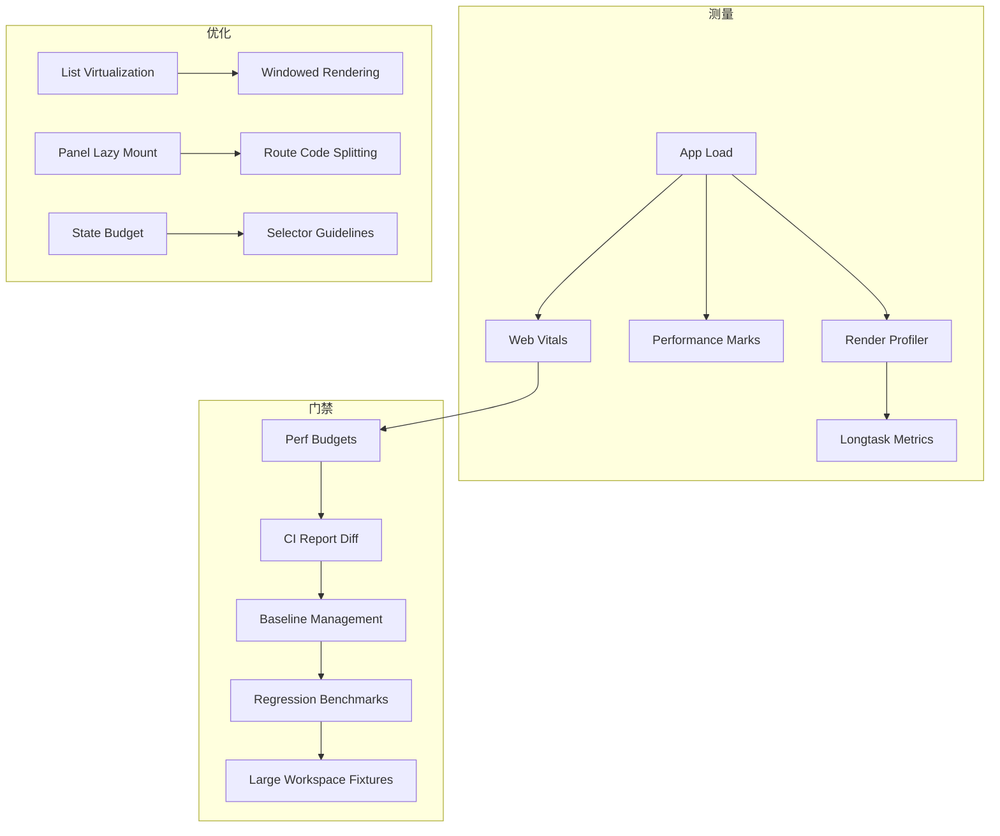

## Why

`c2024` 在定义性能 signals / budgets / overlay / regression harness，`c2230` 在约束 selector 与 render budget，`c2232` 在要求列表虚拟化，`c2233` 在要求 panel lazy mount 与 route code splitting。它们本质上都在回答同一个问题：**workspace 前端怎么在持续加功能的情况下仍然可测、可控、可回归**。

如果继续拆开推进，会出现两个明显问题：

- 性能门禁只会告诉我们“慢了”，却没有同步约束导致变慢的常见结构性原因。
- lazy mount / virtualization / selector discipline 各自存在，但没有统一 metrics 与 benchmark，回归时很难判断到底是哪一层失守。

## Merge Notes

- 合并自 `web-performance-budgets-and-vitals-gates`
- 合并自 `frontend-state-performance-budget-and-selector-guidelines`
- 合并自 `frontend-list-virtualization-and-windowed-rendering`
- 合并自 `workspace-panel-lazy-mount-and-route-code-splitting`
- 合并自 `http-response-caching-etag-and-client-cache-keys`

## What Changes

- 定义前端 runtime 性能 signals：
  - shell ready、panel ready、SSE 首事件/首 token、关键交互 marks
  - LCP / INP / CLS 与路由、build、场景绑定
- 定义性能预算与回归治理：
  - bundle、首屏、关键交互、列表滚动等预算
  - deterministic fixtures、benchmark actions、baseline diff、warn → gate
- 定义 dev-only profiler/overlay：
  - render count、long task、关键 marks、复制摘要
  - 不采集正文内容，只采集计数和耗时
- 定义前端 load shaping 规则：
  - 组件订阅最小 selector，derived state memo 化
  - 高增长列表默认 windowed rendering
  - workspace 壳层先 ready，重面板按需 lazy mount + code split
  - stream / subscription 在壳层集中，避免各面板重复开销
- 定义 HTTP 响应缓存契约：
  - 为 read-heavy endpoints 定义 ETag / If-None-Match / Cache-Control 策略
  - 客户端缓存键由 API client wrapper 统一注入
  - SWR 层把 304 视为"数据未变"，避免无意义 re-render
  - mutation 后 ETag 失效策略（资源版本 bump / cache epoch 变更）
  - v1 先覆盖最热的 5~10 个接口

## Capabilities

### New Capabilities

- `web-performance-budgets`
- `frontend-performance-marks-and-web-vitals-gates`
- `perf-regression-benchmarks-and-large-workspace-fixtures`
- `perf-ci-report-diff-and-baseline-management`
- `frontend-render-profiler-overlay-and-longtask-metrics`
- `frontend-state-performance-budget-and-selector-guidelines`
- `http-response-caching-etag-and-client-cache-keys`
- `frontend-list-virtualization-and-windowed-rendering`
- `workspace-panel-lazy-mount-and-route-code-splitting`

### Modified Capabilities

- `workspace-ui-core`
- `workspace-ui-panels`
- `fullstack-plugin-bundles`
- `frontend-sse-connection-multiplexing-and-resource-guards`
- `api-list-contracts-pagination-filtering-and-field-sets`

## Impact

- Frontend：性能回归不再只靠体感，常见慢路径会有结构性约束和可复现 benchmark。
- DX：可以更快定位是 selector、列表渲染、panel 装配还是 bundle/lazy-load 失守。
- Product：新增面板和重组件时，不再天然拖慢整个 workspace。
- Rollout：默认先以 warn 为主，预算稳定后再转 gate。

## Dependency Sketch

