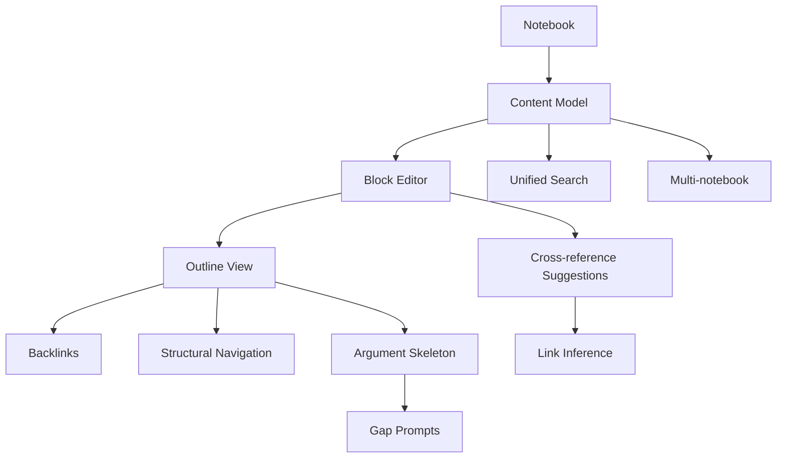

## Why

`c2026` 在定义 notebook block content model，`c3021` 在定义 outline / backlinks / structural navigation，`c3022` 在定义 cross-reference suggestions，`c2098` 在定义从 outline 到 argument skeleton 的中间层。它们本质上都在构建同一层能力：**notebook 作为可编辑、可导航、可推理的结构化知识对象**。

如果继续拆开推进，会有两个直接问题：

- block model、outline、backlinks 和 cross-reference 会各自定义一套“结构节点”，后面很难收口成同一个 notebook substrate。
- argument skeleton 会变成另一个悬空中间表示，无法稳定复用 notebook 的真实结构和回链关系。

## Merge Notes

- 合并自 `notebook-content-model-and-block-editor`
- 合并自 `notebook-outline-backlinks-and-structural-navigation`
- 合并自 `notebook-cross-reference-suggestions-and-link-inference`
- 合并自 `outline-to-argument-skeleton-and-gap-prompts`
- 合并自 `notebook-block-history-and-undo-checkpoints`

## What Changes

- 定义 notebook 结构底座：
  - block-based content model
  - 块级来源、状态、创建方式、引用关系与编辑语义
- 定义 notebook structural navigation：
  - outline tree、block anchors、backlinks、focus / collapse / return-point
  - 结构级落点成为搜索、审阅、跳转与多 notebook 复用的共同入口
- 定义 cross-reference suggestions：
  - link inference 与 suggestion ranking 建立在 notebook 结构、实体与上下文之上
  - 只生成建议与候选关系，不自动静默改写正文
- 定义 argument scaffolding：
  - outline / blocks 可提升为 claim / support / counterpoint / evidence gap skeleton
  - gap prompts 在结构层直接暴露缺口，作为从素材组织到成稿之间的中间工作面
- 定义 notebook block history 与 undo checkpoints：
  - block history 记录块级增删改的轻量历史
  - undo checkpoint 让用户在关键整理动作前后能安全回退
  - 区分局部撤销和结构级回退
  - 历史和撤销信息可被结构导航、差异对比和离线同步共同消费
- 定义 notebook fragments 与 reusable snippets：
  - 把可复用的块组合提炼成独立片段对象
  - 支持在不同 notebook 或 briefing 组装里重复使用片段
  - 区分原地引用和复制副本，避免复用后修改影响不清

## Capabilities

### New Capabilities

- `notebook-content-model-and-block-editor`
- `notebook-outline-backlinks-and-structural-navigation`
- `notebook-cross-reference-suggestions-and-link-inference`
- `outline-to-argument-skeleton-and-gap-prompts`
- `notebook-block-history-and-undo-checkpoints`
- `notebook-fragments-and-reusable-snippets`

### Modified Capabilities

- `workspace-object-model-and-readiness`
- `workspace-ui-core`
- `workspace-ui-panels`
- `multi-notebook-collections`
- `unified-search-query-and-rerank`

## Impact

- Backend：block storage、structure tree、backlink graph、link inference 与 argument skeleton 语义会收口到同一 substrate。
- Frontend：notebook editor、sidebar、search hit 落点、引用跳转和结构级工作面会基于同一结构节点模型。
- Product：notebook 不再只是页面容器，而是可以持续编辑、导航、复用和推理的正式产物。
- Migration：默认直接收口到统一 notebook structure，不保留多套并行结构表示。

## Dependency Sketch

