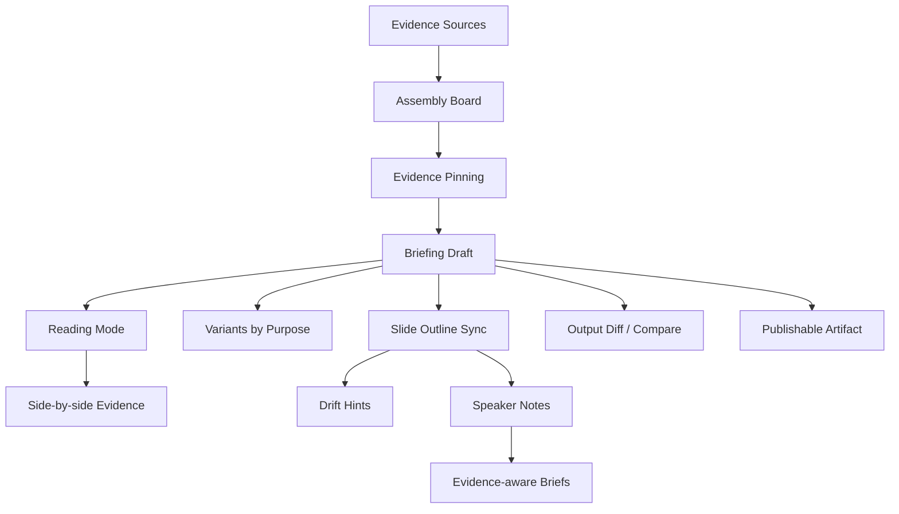

## Why

`c2076` 在定义 briefing assembly board 与 reading mode，`c4054` 在定义按阅读场景切换的 briefing variants，`c1016` 在定义 briefing ↔ slide outline sync 与 drift hints，`c2148` 在定义 evidence-aware slide notes 与 speaker briefs。它们本质上都在建设同一条输出链：**从 briefing 组装与审读，到 slide 映射、证据绑定和场景化交付**。

如果继续拆开推进，会有三个问题：

- briefing 组装、审读、variant 和 slide sync 会各自维护一套结构边界，用户很难知道哪个才是“正式输出”的来源。
- drift hint 如果不和 assembly / review / speaker notes 一起定义，只会停留在结构提醒，无法真正服务交付前复核。
- slide notes 与证据语义如果不复用 briefing 结构，会再次生成一套平行的输出说明层。

## Merge Notes

- 合并自 `briefing-assembly-board-and-evidence-pinning`
- 合并自 `briefing-variants-by-purpose-and-reading-scenario`
- 合并自 `briefing-to-slide-outline-sync-and-drift-hints`
- 合并自 `evidence-aware-slide-notes-and-speaker-briefs`

## What Changes

- 定义 briefing pre-publication workflow：
  - assembly board 作为正式 briefing 之前的组装工作面
  - evidence pinning、半成品边界与正式 briefing 流转规则
- 定义 briefing review surfaces：
  - reading mode、side-by-side evidence、按章节切换证据强度
  - purpose-based variants 复用同一主张、证据和不确定性，只改变组织和阅读密度
- 定义 briefing ↔ slide structure sync：
  - briefing 结构与 slide outline 建立可追踪映射
  - drift hints 区分自动可同步部分与只提示不自动改写部分
- 定义 slide delivery notes：
  - evidence-aware slide notes、speaker briefs 与 briefing 结构、附录、证据回链打通
  - slide 讲述层不再脱离其来源证据与 drift 状态

## Capabilities

### New Capabilities

- `briefing-assembly-board-and-evidence-pinning`
- `briefing-reading-mode-and-side-by-side-evidence`
- `briefing-variants-by-purpose-and-reading-scenario`
- `briefing-to-slide-outline-sync-and-drift-hints`
- `evidence-aware-slide-notes-and-speaker-briefs`

### Modified Capabilities

- `publishable-artifacts`
- `output-draft-lifecycle-and-regeneration-safety`
- `studio-slides-workflow`
- `output-diff-compare-and-version-review`
- `evidence-appendix-autobuild-and-traceable-footnotes`

## Impact

- Backend：briefing assembly 对象、variant metadata、sync mapping、drift detection 与 slide note metadata 会收口。
- Frontend：briefing 编排、审读、variant 切换、slide 编辑与讲述备注会建立在同一结构映射上。
- Product：输出从“生成完再看”升级到“先组装、再审读、再同步交付”。
- Migration：默认直接统一到这条 composition/review/sync 流程，不保留多套并行输出边界。

## Dependency Sketch

