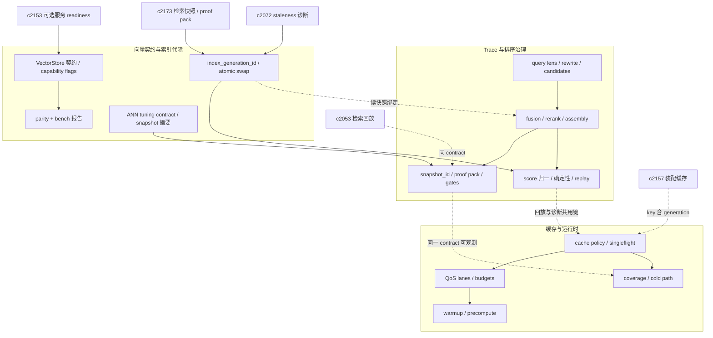
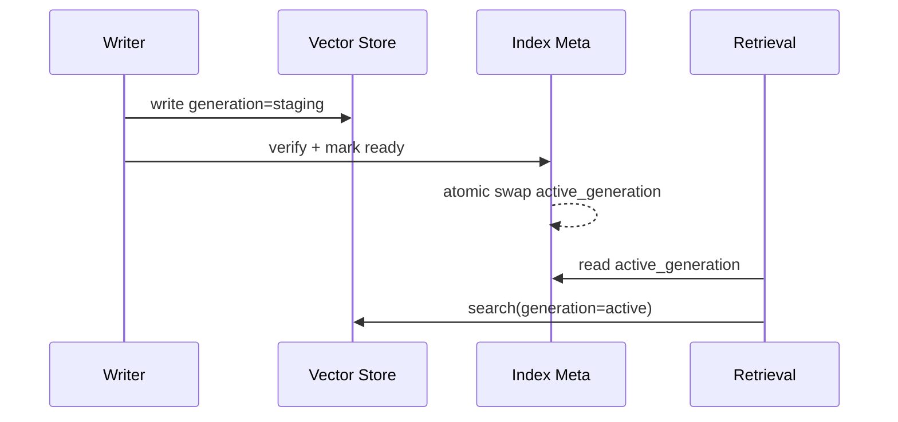
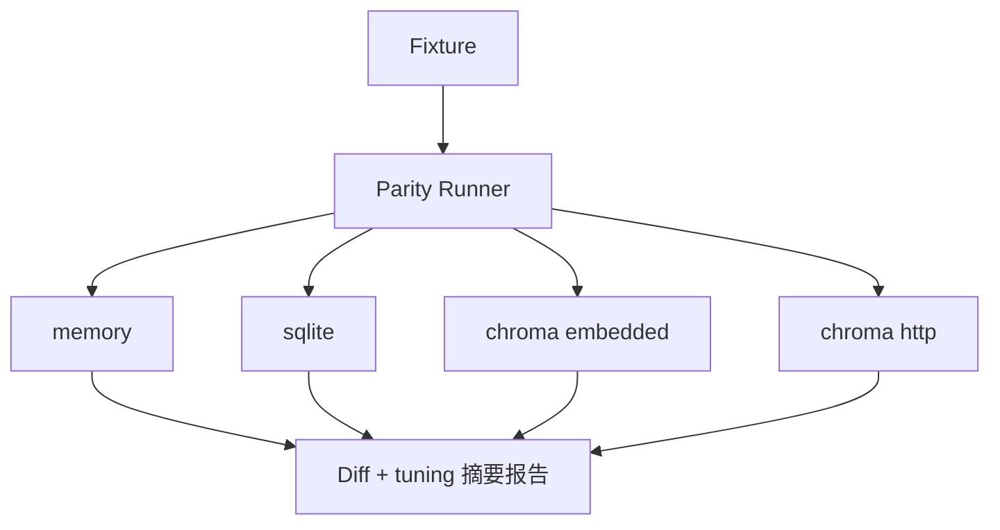

## Why

检索治理存在多条相互缠绕的硬问题。**其一（结果可信与可回放）**：`c2053` / `c2059` / `c2173` / `c2175` / `c2183` 等所覆盖的 trace、lens、rerank、snapshot、proof pack、分数语义若各自记录「检索过程」，会失去单一真相；回归与 replay 需要统一的 score semantics、tie-break 与确定性说明；调试解释不能停留在 UI 文案，而须与真实排序、fusion、trace、回放同源。**其二（负载下的可解释与可保护）**：`c2157` / `c2169` / `c2185` / `c2188` / `c2131` 等所覆盖的 cache、singleflight、warmup、QoS、cold path 若各自定义资源规则易冲突；cold-path 检测若只报慢，无法区分 admission、bypass、stampede、未预热或 lane 让路。**其三（向量底盘的一致性与可测性）**：向量存储是 RAG 底盘；多种 provider（memory / sqlite / chroma embedded / chroma HTTP）行为差异累积后，易出现「本地能跑、换 profile 结果变了」的不信任，既不敢切 provider 也不敢做性能优化。需要一份**可写进测试的契约**：哪些操作必须一致、哪些差异须显式声明、哪些体现在 UI/诊断上；过滤/排序能力须以 **capability flags** 显式表达，避免假装全支持。

与此同时，索引在逻辑上常是「写进去即生效」；在全量重建、embedding 升级、半成功写入或检索回放（`c2173`）时，会出现一致性裂缝。代码里虽有 `vector_epoch` / `sources_epoch` 等主要服务缓存失效的概念，但不等同于**读快照**。需要更接近事务语义的 **index generation**：读取始终落在明确的 generation 上，并与契约测试、ANN 调参、readiness 降级、装配缓存 key 同一套叙事里落地。

将 **trace / 排序 / 回放**、**cache / QoS / 预热 / 冷路径** 与 **向量契约 / provider 对等 / 代际读快照 / ANN 调参** 收口为同一套检索治理面，才能同时回答「为什么得到这组结果」「为何慢、为何未命中、为何被延后」以及「当前读的是哪一代索引、provider 差异是否声明过、近似回放边界在哪里」。

**主题**：Retrieval governance: trace, ranking, vector store contract, parity & ANN tuning。

> 合并说明：本提案合并了原 `retrieval-cache-qos-warmup-and-cold-path-governance` 的全部内容。

> 合并说明：本提案合并了原 `vector-store-contract-parity-and-ann-tuning` 的全部内容。

## 公共合成焦点

**Trace / 排序 / 回放**回答「为何得到这组结果」；**cache / QoS / 预热 / 冷路径**回答「为何慢、为何未命中、为何被延后」；**向量契约 / generation / ANN**回答「读自哪一代索引、provider 能力边界与调参如何进入快照与门禁」。三者必须挂在同一 **retrieval contract** 下：同一次检索可用 `snapshot_id`（或等价键）串联 candidate→fusion→rerank 的解释与 `cache_status` / lane / bypass 的解释；`retrieval_snapshot` 同时承载 `index_generation_id` 与（在声明范围内）**ANN tuning 摘要**，使回归与诊断不在「结果真相」「运行时真相」「索引真相」之间分裂。Warmup 与 coverage 地图则应能反证 trace 中观察到的波动是否来自未预热、stampede、策略性 bypass，或来自 provider/代际切换与近似 ANN。

## 一体化原则（公共项收口）

1. **单一诊断键**：`snapshot_id`（及并行的 request/correlation 索引）同时挂载 trace 段、最终排序、缓存命中/旁路与 lane 决策；必要时与 `index_generation_id` 联合索引；debug UI 不得维护第二套「解释 id」。
2. **分数语义唯一**：`similarity_score` 归一与 tie-break 文档同时约束向量侧、fusion 与 rerank；cache 层与向量 provider 不得引入改变序关系的隐式二次缩放（除非契约显式声明并进入 parity 报告）。
3. **降级可解释**：bypass、soft TTL、lane 让路、warmup 跳过、remote provider blocked/降级、generation 近似回放等均须产生与 trace 对齐的 reason code，便于 cold-path 地图与回放视图归因。
4. **回归同构**：citation/retrieval 回归用与线上相同的 assembly 路径、cache 模式开关与（在可及范围内）同 generation / 同 tuning 摘要策略，避免「测环境全命中、线上全冷」或「bench 绿、换 provider 序变」的假绿。

## 公共项详述（向量层 × 追踪层 × 缓存层）

下列条目是两条历史提案的**交集落地**，实现时优先按此对齐，避免重复造「第二套叙事」。

| 公共 concern | 向量/索引侧（c2154 收口） | 追踪/排序侧（c4079 收口） | 合一约束 |
| --- | --- | --- | --- |
| **读一致性** | `index_generation_id`、staging→active 原子切换 | `retrieval_snapshot`、replay 同代优先 | snapshot 必须能回答「本次读的是哪一代」；近似回放须显式标记 |
| **分数与序** | ANN 近似、provider 间 recall/latency 差异 | 归一分数、fusion、rerank、tie-break | 序变来源须可归因：ANN / provider / rerank / cache，不得混为单一「相似度坏了」 |
| **可测性** | parity suite、bench、capability flags | proof pack、回归门禁、coverage 地图 | 同一 fixture/workload 既服务契约 diff，也服务检索回归；门禁失败须指向具体层（契约 vs 排序 vs 缓存） |
| **配置与降级** | embedded vs remote、readiness、`c2153` | QoS lane、bypass、blocked 可解释 | 用户可见文案与运维诊断共用 reason vocabulary，避免 UI 说一套、日志另一套 |
| **缓存键** | generation 参与一致性读 | assembly/embedding/search 缓存与 epoch | 装配缓存 key **纳入 generation**；epoch 负责失效与性能，generation 负责「读到哪份索引」 |

**端到端观测切片（实现检查清单）**：单次检索请求在 trace 中应能串联——（1）选用的 vector provider 与 capability 摘要；（2）绑定的 `index_generation_id` 与是否近似回放；（3）ANN tuning 摘要（若声明支持）；（4）各段 cache 的 `cache_status` / bypass；（5）最终 fusion/rerank 的 top/dropped reasons。冷路径地图与 warmup 收益指标应能解释上述任一步的异常波动。

## 跨层公共验收口径（合成）

下列口径同时约束 **trace/排序**、**缓存/QoS** 与 **向量契约/代际**，作为「公共项」的验收锚点，避免各层各自达标却拼不出一致故事。

1. **同一请求可串图**：给定 `snapshot_id`（及关联 correlation），可从 UI 或导出包中还原：provider + capability 摘要 → generation 与是否近似回放 → 各段 cache 决策 → fusion/rerank 最终序与原因码；缺失任一环即视为治理面未闭合。
2. **序变可归因**：任意两次结果 top-K 不一致时，diff 报告须能指向以下之一或组合：ANN/provider 声明差异、generation 切换、rerank/fusion 配置、cache bypass 或命中路径、QoS lane 让路；不得仅给出「分数变了」而无层级标签。
3. **契约与回归同fixture**：parity suite、profile bench 与 retrieval/citation 回归应共享或显式派生同一批 fixture/workload；门禁失败信息须区分「向量契约违反」「排序/融合违反」「缓存策略违反」，便于排障分流。
4. **降级与 blocked 同源**：向量侧 blocked/readiness、缓存 admission 拒绝、lane 队列满或降级，使用与 trace 对齐的 reason vocabulary；诊断文案、日志字段与 API 错误体不得三套说法。
5. **代际与缓存键一致**：装配/检索相关缓存键在语义上绑定 `index_generation_id`（或等价稳定句柄）；epoch  bump 不得单独冒充 generation 切换的解释，须在文档与 trace 中区分「性能失效」与「一致性读版本」。
6. **ANN 与快照共演进**：若 provider 支持 tunable ANN，则 tuning 变更须进入 tuning 摘要、bench 对比与（在范围内）`retrieval_snapshot`；高风险 knob 的变更路径必须经过门禁，与普通 UI 配置分流。

## Merge Notes（历史合并溯源）

- 本变更目录历史上已合并：`retrieval-query-trace-and-search-replay`、`retrieval-intent-presets-and-query-lens`、`retrieval-proof-packs-and-quality-gates`、`hybrid-retrieval-rerank-and-debug-explanations`、`vector-search-determinism-and-score-normalization`。
- 历史上自 `c4080` 所收口：`retrieval-context-assembly-cache-and-metrics`、`cache-policy-visibility-and-stampede-guards`、`retrieval-qos-budgets-and-priority-lanes`、`hot-notebook-warmup-and-cache-precompute`、`cache-coverage-maps-and-cold-path-detection`。
- 本次再合并自 `c2154`（其自身已含 `vector-index-generation-ids-and-atomic-read-snapshots` 的合并溯源）：向量存储契约、provider parity、benchmark 与 profile 报告、ANN tuning contract、`index_generation_id` 与原子读快照、与 `c2153` readiness / `c2072` staleness 等的衔接叙事。

## What Changes

### 1. 检索 trace、混合检索与确定性回放

1. **检索 trace 基底**：query lens、seed catalog、rewrite 阶段、candidate sets、fusion、rerank、assembly、citation binding；以 `snapshot_id` 作为回放、诊断、回归与 bug report 的统一键。
2. **混合检索治理**：vector / lexical / hybrid 模式、fusion policy、fallback reason codes；rerank feature contract 与 top reasons / dropped reasons 解释。
3. **确定性与回放语义**：归一化 `similarity_score`；稳定排序 / tie-breaker / ANN 波动说明 / determinism notes；区分精确可回放与近似可回放；与 generation 绑定及「非同代」近似回放声明对齐。
4. **Proof pack 与门禁**：最小 retrieval proof pack、分享边界、脱敏；retrieval/citation 回归套件、质量门禁、diff report 与 replay 入口；吸收 ANN / provider 变动与代际切换的可解释门槛。

### 2. 缓存、QoS、预热与冷路径

5. **缓存策略基底**：assembly / embedding / vector-search 等缓存的 key、TTL、admission、`bypass_reason`；`cache_status`、`staleness_reason`、singleflight、soft TTL + jitter；装配缓存 key 纳入 `index_generation_id`（与 `c2157` 一致方向）。
6. **运行时 QoS**：interactive / background / maintenance 等 lane；embedding/vector 预算、最大排队时间、降级与让路策略。
7. **预热与预计算**：hot notebook warmup 目标、触发条件、预算护栏；预热作为 background lane 下受控任务，避免无边界后台工作。
8. **诊断与冷路径**：cache coverage maps、cold path detection、hit/miss/benefit 指标；解释路径为何恒冷、为何持续 bypass、为何被 lane 延后。

### 3. 向量存储契约、对等测试与诊断配置

9. **VectorStore 最小契约**：upsert / delete / query 的语义边界与返回结构；metadata 字段规范（稳定绑定 source / chunk / created_at）；embedding 维度与模型切换时的失败/迁移策略；过滤/排序的 **capability flags**，避免假装全支持。
10. **Provider parity test suite**：同一 fixture 在所有 provider 上跑，输出一致性差异报告（允许「声明过的差异」）。
11. **Benchmark harness + profile parity report**：真实 chunk 分布 fixture（`c2164` / `c2082`）；workload 覆盖 add/upsert/remove/search/search_many；metrics 含吞吐、p50/p95、缓存命中、资源占用；报告解释差异原因（ANN、RTT、写放大）并给默认 profile/调参建议。
12. **Config 语义与诊断**：如 chroma host/port/path 如何判定 embedded vs remote，判定结果暴露给诊断；provider readiness 与 `c2153` 可选服务 readiness 打通（remote 不可用时降级 sqlite 或 blocked，可配置且可解释）。

### 4. ANN 调参与索引代际

13. **ANN tuning contract**（如 HNSW）：knob 名称、范围、默认值、是否可在线改；对 latency/recall/variance 的影响声明；provider 须显式声明不支持；`c2173` 的 retrieval_snapshot 附带 tuning 摘要；高风险参数不直开给普通用户，变更走 bench + 回归门禁。
14. **`index_generation_id`（每 notebook 一个 active generation）**：新写入可落在 `active` 或 `staging`（按任务类型）；仅当 staging 校验通过才原子切换为新的 active。
15. **Atomic read snapshot**：检索绑定 generation（默认当前 active）；`retrieval_snapshot` 含 `index_generation_id`；replay 优先同 generation，否则标明近似回放。
16. **Generation switch 可解释输出**：切换原因、时间、涉及 source 范围、校验摘要；与 cache epoch 对齐（generation 管一致性读，epoch 管缓存失效与性能）。

## Capabilities

### New Capabilities

- `retrieval-query-trace-and-search-replay`
- `retrieval-debug-workbench`
- `retrieval-result-clustering-and-duplicate-collapse`
- `retrieval-intent-presets-and-query-lens`
- `query-rewrite-seed-catalog-and-explainability`
- `retrieval-snapshot-ids-and-deterministic-replay`
- `retrieval-proof-packs-and-evidence-bug-reports`
- `retrieval-citation-regression-suite-and-quality-gates`
- `rerank-feature-contract-and-debug-explanations`
- `hybrid-retrieval-lexical-vector-fusion-and-fallbacks`
- `vector-search-determinism-and-score-normalization`
- `retrieval-context-assembly-cache-and-metrics`
- `embedding-cache-policy-and-visibility`
- `vector-search-cache-policy-and-stampede-guards`
- `retrieval-qos-budgets-and-priority-lanes`
- `hot-notebook-warmup-and-cache-precompute`
- `cache-coverage-maps-and-cold-path-detection`
- `vector-store-contract-and-provider-parity`：向量存储契约、provider 能力声明与一致性测试基线。
- `ann-index-tuning-contract-and-provider-knobs`：ANN 调参契约、tuning snapshot 与安全边界。
- `vector-store-benchmarks-and-profile-parity-reports`：benchmark、workload 与性能对比报告。
- `vector-index-generation-ids-and-atomic-read-snapshots`：索引代际、原子切换与一致性读快照。

### Modified Capabilities

- `unified-search-query-and-rerank`
- `retrieval-and-cache`：消费 capability flags，解释 provider 差异；与 trace/QoS/generation 叙事对齐。
- `search-index-incremental-refresh-and-staleness-diagnostics`：staleness 能解释 generation 差异。（`c2072`）
- `run-input-snapshots-and-repro-packs`
- `request-context-and-correlation-ids`
- `optional-services-readiness-contract`：remote provider readiness 统一解释。（`c2153`）
- `profile-capability-matrix-and-degraded-mode-explainer`
- `upstream-rate-limit-handling-and-retry-after-contract`
- `source-ingestion-core`：写入向量存储的元数据标准化。
- `local-environment-drift-and-dependency-audits`：环境漂移覆盖 provider 差异。（`c1035`）
- `retrieval-snapshot-ids-and-deterministic-replay`：snapshot 携带 tuning 摘要与 `index_generation_id`。（`c2173`）
- `retrieval-citation-regression-suite-and-quality-gates`：回归吸收 ANN 变动。（`c2173`）
- `vector-store-contract-and-provider-parity`：provider 声明是否支持 generation / swap。
- `retrieval-context-assembly-cache-and-metrics`：装配缓存 key 纳入 generation。（`c2157`）

## Impact

- **Backend**：检索 trace、score normalization、fusion/rerank 解释、snapshot/proof pack 与回归门禁，与 cache key/策略、排队、warmup runner、coverage 遥测统一为同一条 retrieval contract；向量读写查询统一封装、能力声明、契约测试与差异报告；写入/查询带 generation，安全 swap（可实现为新 collection + 切指针）；provider knob 与配置治理，tuning 纳入 trace/snapshot 与门禁。
- **Frontend**：debug/compare/replay、top/dropped reasons 与「为何这次不一样」同源；诊断面可直接呈现慢因、未命中与延后原因；诊断与错误提示解释当前 provider、能力与降级/blocked；回放视图展示结果来自哪一 generation 与（在范围内）tuning 摘要。
- **Quality / Operations**：检索漂移、引用退化与 provider 抖动可更早识别并可解释阻断；能稳定区分冷启动、热点雪崩、过度 bypass、QoS 降级与代际/ANN 近似带来的序变。
- **DevEx**：性能与一致性可测、可回归；parity 与 bench 报告支撑换 profile 与调参决策。
- **Migration**：默认收口到统一检索治理语义，不保留多套平行的 debug/replay、cache/QoS 策略与「未声明的」向量行为差异说明。
- **Risk**：generation 设计过重会拖慢日常写入——小写入路径须保持轻量。
- **Non-goals**：不在此引入新的向量数据库；先钉住已有 provider 行为。

## Dependency Sketch

