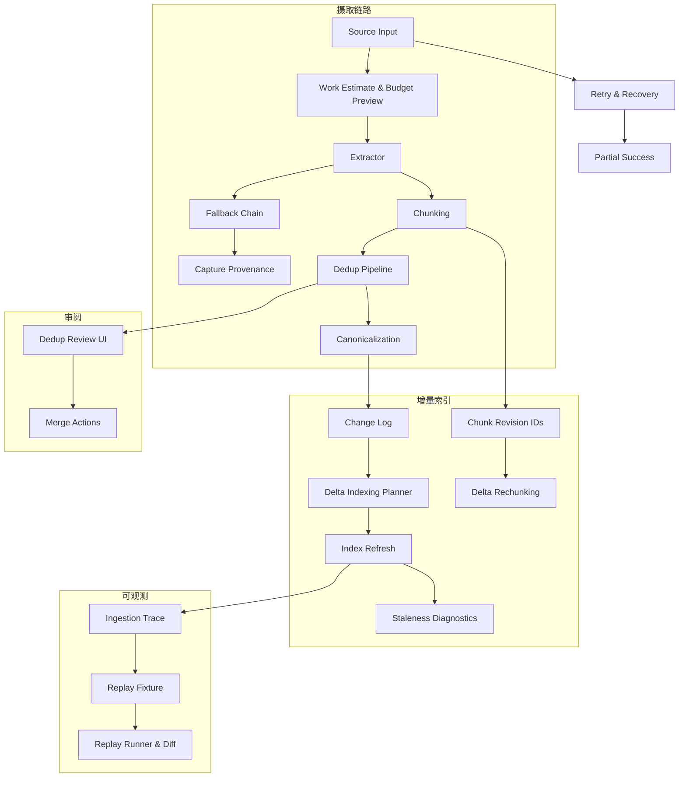

## Why

`c2030` 在定义 source ingestion stages / retry / partial success，`c2045` 在定义 canonicalization / dedup review，`c2048` 在定义 extractor fallback 与 capture provenance，`c2072` 在定义 incremental refresh / staleness diagnostics，`c2191` 在定义 source change log / delta plan，`c2202` 在定义 chunk revisions / delta rechunking。它们本质上都在描述同一条基础管线：**source 内容如何被可靠接入、解释、去重、增量更新并最终稳定进入索引可见性**。

如果继续拆开推进，会出现三个问题：

- ingestion、extractor provenance、dedup 与 delta indexing 会分别定义“source 发生了什么变化”，最后没有统一真相。
- staleness diagnostics 想解释“为什么还搜不到”，但没有统一的 change log、chunk revision 和 refresh lifecycle 作为基础。
- dedup / canonicalization 如果不与 chunk revision 和增量刷新一起设计，就会在后面不断引入重复 rebuild 和错误 alias。

## Merge Notes

- 合并自 `source-ingestion-contracts-dedup-and-chunking`
- 合并自 `source-deduplication-and-canonicalization-pipeline`
- 合并自 `extractor-fallback-chain-and-capture-provenance`
- 合并自 `search-index-incremental-refresh-and-staleness-diagnostics`
- 合并自 `source-change-log-and-delta-indexing-planner`
- 合并自 `chunk-revision-ids-and-delta-rechunking`
- 合并自 `ingestion-work-estimates-and-budget-preview`
- 合并自 `ingestion-trace-and-replay-fixtures`

## What Changes

- 定义 ingestion work estimate（导入前预估）：
  - 在导入前给出大致工作量、潜在步骤和等待预期
  - 支持 budget preview，说明会触发哪些重任务（提取、解析、切块、索引、摘要）
  - 区分粗略预估和已知确定项，避免把估算伪装成精确承诺
  - 预估信息既服务用户决策，也服务系统调度和背压提示
- 定义 source ingestion substrate：
  - discover → fetch → extract → parse → chunk → embed → index
  - stage artifacts、retry / recovery / partial success 与 failure classification
- 定义 extractor provenance：
  - fallback chain、capture provenance、内容折损解释
  - extractor 选择和失败不再只是内部日志
- 定义 canonicalization and dedup：
  - content fingerprint、canonical source、alias/redirect、duplicate groups
  - dedup review 与 merge/ignore/park 的可逆动作边界
- 定义 ingestion trace 与 replay fixture（可观测与调试层）：
  - 一次接入生成一条 trace，包含阶段事件（fetch/extract/parse/normalize/chunk/embed/index/persist）、耗时、关键参数摘要与失败分类
  - replay fixture：把可复现所需的最小输入打包（规范化后的中间表示、chunk 列表、关键配置摘要），并标记脱敏策略
  - 默认只存摘要与结构，不存原始大文本；token/headers/cookie 等敏感字段永不落盘
  - replay runner：用 fixture 重新跑解析/切块/索引等阶段，产出一致性 diff（chunk 数量变化、锚点漂移、向量写入失败原因）
  - trace 与 repair/诊断链路对齐：Sources 面板可看失败步骤与补救建议；developer diagnostics 可按 correlation_id 追踪
- 定义 delta indexing control plane：
  - source change log、delta indexing plan、chunk revisions、delta rechunking
  - incremental refresh、staleness diagnostics、visibility lifecycle

## Capabilities

### New Capabilities

- `source-ingestion-dedup-and-chunking`
- `source-ingestion-retry-recovery-and-partial-success`
- `source-deduplication-and-canonicalization-pipeline`
- `source-dedup-review-ui-and-merge-actions`
- `extractor-fallback-chain-and-capture-provenance`
- `search-index-incremental-refresh-and-staleness-diagnostics`
- `source-change-log-and-delta-indexing-planner`
- `chunk-revision-ids-and-delta-rechunking`
- `ingestion-work-estimates-and-budget-preview`
- `ingestion-trace-and-replay-fixtures`

### Modified Capabilities

- `source-ingestion-core`
- `source-connectors`
- `source-ingestion-management-and-tags`
- `retrieval-and-cache`
- `background-jobs-and-task-runtime`
- `concurrency-budgets-and-backpressure-visibility`
- `request-context-and-correlation-ids`: trace 必须挂上 correlation_id。
- `execution-trace-and-replay-lab`: ingestion trace 是执行 trace 的一类上游素材。

## Impact

- Backend：source artifacts、provenance、canonicalization、change log、chunk revisions 与 refresh jobs 会收口到同一条管线。
- Frontend：sources 面板、duplicates review、来源详情和 staleness diagnostics 会获得统一解释基础。
- Search quality：减少重复 source / chunk 噪声，降低无意义全量重建，提升“为什么还没可见”的解释能力。
- Debug：ingestion trace + replay fixture 让接入问题可离线复现，不再靠"追鬼"排障。
- Migration：默认直接收口到统一 source pipeline，不保留多套散装 dedup/provenance/index refresh 语义。

## Dependency Sketch

