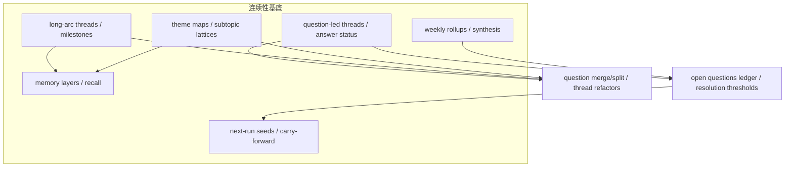

## Why

`c3023`（personal memory layers / recall views）、`c2090`（long-arc threads / milestones）、`c2105`（question-led threads / answer status）、`c2106`（cross-thread theme maps）、`c3025`（weekly synthesis / rollups）、`c3026`（next-run seeding / carry-forward briefs）本质上都在建设同一条长期连续性能力：**个人如何把分散的 runs、sources、notes、outputs 与问题，沉淀为可回看、可延续、可组织的知识轨迹**。若继续拆开推进，会出现记忆层、长线线程、问题线程与周综合各自保存「过去做了什么」、缺少统一 continuity substrate，carry-forward 与 theme map 易退化为孤立层。

与此同时，研究做久了最容易积压的往往不是材料，而是**长期悬而未决的问题**：它们散在线程、笔记与 run 结果里，缺少一份可主动清理、合并与关闭的**总账**与**收口阈值**。将「连续性基底」与「未决问题账本」合并，可把问题管理从线程级抬升到全局账本级，并与周综合、续跑种子稳定互通。

## What Changes

### 1. 个人记忆基底（personal memory substrate）

- hot / working / archive 等记忆分层。
- recall views：按主题、对象、时间与停下位置回看。

### 2. 线程化研究连续性（threaded research continuity）

- long-arc threads、milestones、dormant resurfacing。
- question-led threads、answer status 与 thread-to-thread relations。

### 3. 周期综合（periodic synthesis）

- weekly synthesis、knowledge rollups、阶段总结节点。
- rollups 回接 threads、memory layers 与后续执行入口。

### 4. 下一次 Run 连续性（next-run continuity）

- next-run seeds、carry-forward briefs、user-confirmed vs system-suggested seeds。
- 让单次 run 的未闭合问题与建议动作稳定进入下一次执行。

### 5. 跨线程地图（cross-thread maps）

- theme maps、subtopic lattices、跨线程共享问题/概念/证据簇。
- 定位在 recall、navigation 与 synthesis 的轻量地图，而非另造完整知识图谱系统。

### 6. 问题合并拆分与线程重构（question merging, splitting & thread refactors）

- 定义 question/thread refactor，支持问题合并、拆分和主题线程重组。
- 增加 lineage 记录，保留"这个新问题是从哪条旧线拆出来的"。
- 支持重构后带着来源、摘要、假设和 run 种子一起迁移。
- 保持重构是个人整理动作，不引入团队协作流程。

### 7. 未决问题总账与收口阈值（open questions ledger & resolution thresholds）

- 将未决问题集中为可持续维护的总账（open questions ledger）。
- 定义 resolution threshold：何种程度可视为「现阶段可先收口」。
- 区分「已暂时足够回答」「仍缺核心证据」「不值得继续深挖」等关闭方式。
- 账本与问题线程、周综合、next-run seeds / carry-forward 互通。

## Capabilities

### New Capabilities

- `personal-memory-layers-and-recall-views`
- `weekly-synthesis-and-personal-knowledge-rollups`
- `next-run-seeding-and-carry-forward-briefs`
- `long-arc-threads-and-milestone-checkpoints`
- `question-led-research-threads-and-answer-status`
- `cross-thread-theme-maps-and-subtopic-lattices`
- `question-merging-splitting-and-thread-refactors`
- `open-questions-ledger-and-resolution-thresholds`

### Modified Capabilities

- `daily-review-resurfacing-and-deferred-items`
- `workspace-ui-core`
- `run-postmortem-summaries-and-recommendation-loops`
- `research-plan-editor-and-execution-checklists`
- `reading-queue-prioritization-and-guided-order`

## Impact

- **Backend**：memory projection、thread relations、rollup nodes、carry-forward seeds、theme-map indexing 与**问题索引、关闭状态、账本聚合**统一在同一 continuity model 下演进；本变更内各线程/综合/种子相关能力的 delta 须与未决问题账本互操作（入总账、出续跑种子、周综合呈现未决趋势）。
- **Frontend**：home / recall / thread / weekly synthesis / continue-next-run 与**问题总览、收口提示、继续入口**建立在同一模型上。
- **Product**：从「零散工作痕迹」升级为「可持续接力的个人知识轨道」，并具备**可治理的未决问题闭环**。
- **Migration**：默认收口到统一 continuity model，不保留多套平行的记忆、线程、续跑与问题账本语义。

## Dependency Sketch

> 合并说明：本提案合并了原 `open-questions-ledger-and-resolution-thresholds` 的全部内容。

## 合并溯源

- 合并自 `personal-memory-layers-and-recall-views`
- 合并自 `weekly-synthesis-and-personal-knowledge-rollups`
- 合并自 `next-run-seeding-and-carry-forward-briefs`
- 合并自 `long-arc-threads-and-milestone-checkpoints`
- 合并自 `question-led-research-threads-and-answer-status`
- 合并自 `cross-thread-theme-maps-and-subtopic-lattices`
- 合并自 `question-merging-splitting-and-thread-refactors`
