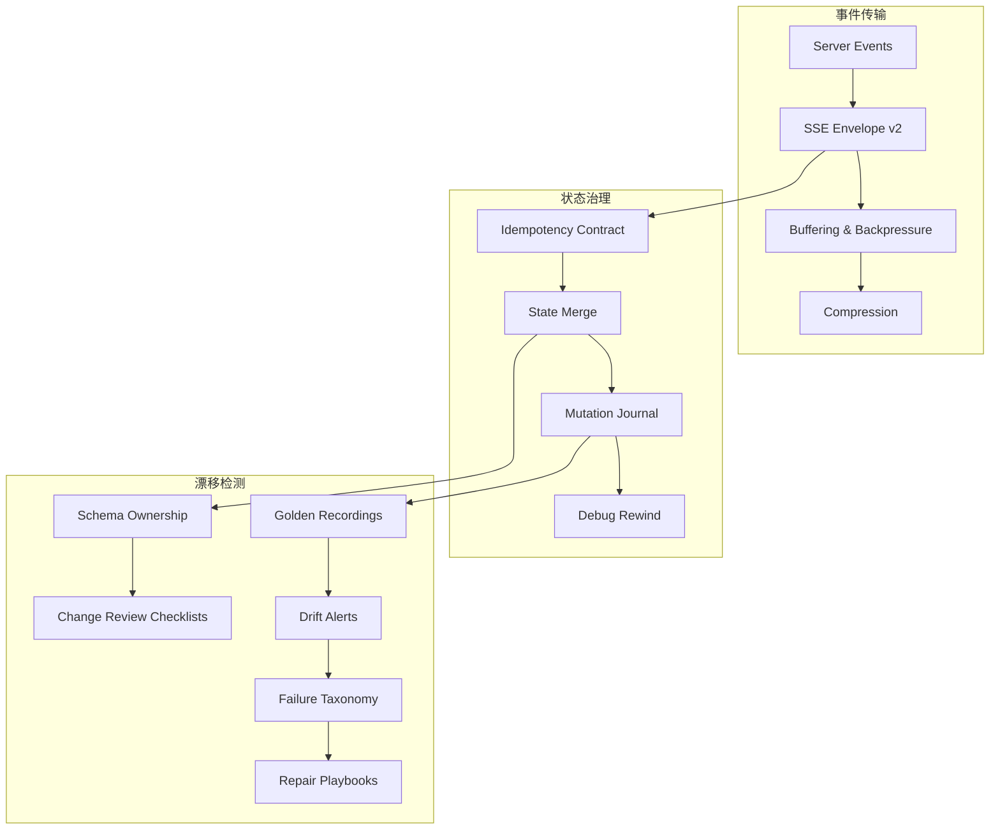

## Why

`c2006` 在定义统一 SSE event envelope，`c2161` 在定义 UI event idempotency / shared state merge contract，`c2101` 在定义 state mutation journal / debug rewind，`c2102` 在定义 UI contract golden / drift alerts，`c2116` 在定义 state ownership / review checklist / repair playbooks。它们本质上都在治理同一层：**UI state 如何被传输、合并、记录、校验、发现漂移并修复**。

如果继续拆开推进，会有三个问题：

- SSE event、UI event receipts、mutation journal 和 UI contract golden 会分别记录“状态是怎么变的”，没有统一的状态治理真相。
- drift alert 能发现结构漂移，但如果不和 ownership / failure taxonomy / repair playbook 一起定义，就停留在告警，不形成修复闭环。
- shared state merge 和 debug rewind 若没有事件信封与 journal 作为基础，就会继续是局部能力，难以跨 endpoint 和工作面统一。

## Merge Notes

- 合并自 `unified-event-model-and-sse-contract`
- 合并自 `ui-event-idempotency-and-shared-state-merge-contract`
- 合并自 `state-mutation-journal-and-debug-rewind`
- 合并自 `ui-contract-golden-recordings-and-drift-alerts`
- 合并自 `state-schema-ownership-checklists-and-repair-playbooks`

## What Changes

- 定义 UI state transport contract：
  - unified SSE event envelope、event ids、correlation、replay window、error mapping
  - UI event receipts、idempotent apply/replay/conflict、shared_state revision/delta
- 定义 state mutation traceability：
  - mutation journal、debug rewind、receipt retention/compaction
  - UI event、system mutation 与 recovery mutation 使用统一上游语义
- 定义 drift governance：
  - UI contract golden recordings、drift alerts、schema/state ownership checklists
  - 关键工作面的 contract baseline 与 review gate
- 定义 repair loop：
  - contract failure taxonomy、repair playbooks、ownership-guided review
  - drift 发现后有标准分类和恢复路径，而不是只留 warning

## Capabilities

### New Capabilities

- `sse-event-envelope-v2`
- `sse-server-side-buffering-backpressure-and-compression`
- `ui-event-idempotency-and-shared-state-merge-contract`
- `state-mutation-journal-and-debug-rewind`
- `ui-contract-golden-recordings-and-drift-alerts`
- `state-schema-ownership-and-change-review-checklists`
- `contract-failure-taxonomy-and-repair-playbooks`

### Modified Capabilities

- `workspace-shared-ui-state`
- `workspace-api-contract`
- `chat-ui-envelope`
- `dev-diagnostics-workbench-and-state-dumps`
- `schema-snapshot-catalog-and-regression-baselines`

## Impact

- Backend：stream envelope、UI event processing、mutation journal 与 drift/repair metadata 会统一到同一套 state governance contract。
- Frontend：SSE client、shared state merge、contract golden 录制与 drift diagnosis 会用同一结构基础。
- DX：重构时不仅能提前看到 drift，还能沿 ownership / taxonomy / playbook 快速定位与修复。
- Migration：默认直接升级到统一 event/state governance，不保留旧的散装 SSE payload 和局部 drift 约定。

## Dependency Sketch

