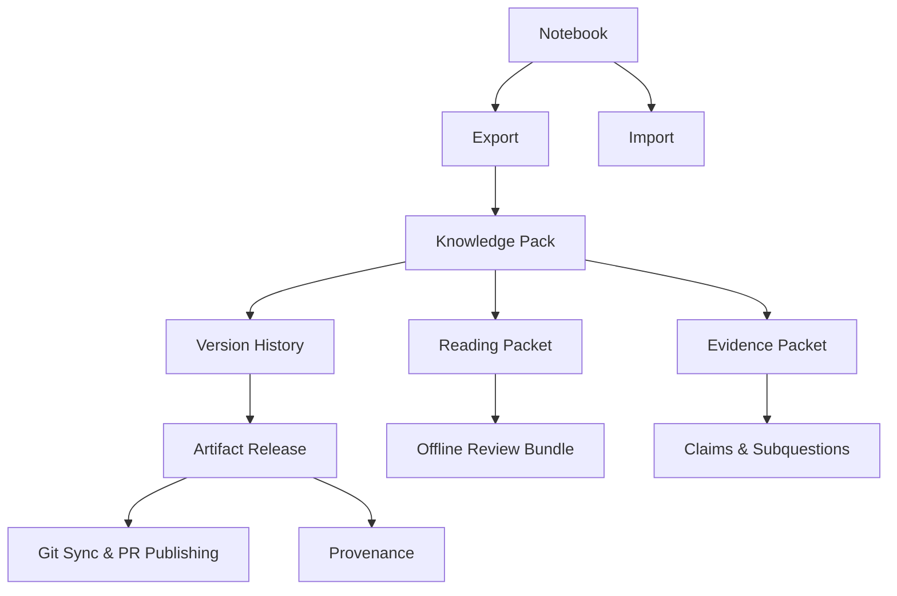

## Why

`c4001` 在定义 knowledge packs，`c4005` 在定义 artifact versioning / release channels，`c4006` 在定义 notebook import/export interoperability，`c4047` 在定义 reading packets / offline review bundles。它们本质上都在建设同一条交付链：**研究产物如何从内部对象变成可打包、可版本化、可互通、可审读、可发布的正式交付件**。

如果继续拆开推进，会有三个问题：

- pack、version、export 和 review bundle 会各自定义“正式交付件”的边界，最后没有统一 artifact packaging 真相。
- notebook interoperability 如果不和 version/release 一起设计，就会退化成一堆孤立导出器。
- offline review bundle 若不复用 pack/version/provenance 结构，就会变成另一条并行分发链。

## Merge Notes

- 合并自 `publish-and-share-knowledge-packs`
- 合并自 `artifact-versioning-and-release-channels`
- 合并自 `notebook-import-export-interoperability`
- 合并自 `reading-packets-and-offline-review-bundles`

## What Changes

- 定义 artifact packaging substrate：
  - knowledge packs 作为多输出、多证据关系的正式包装对象
  - pack summary、cover、export metadata 与 provenance 摘要
- 定义 artifact lifecycle：
  - release candidates、approved releases、archived releases、release channels
  - stable version refs、version compare、channel binding、Git/PR publishing hooks
- 定义 interoperability：
  - notebook 与 Markdown / Jupyter / PDF / Slides 等主要形态的 import/export contract
  - fidelity / downgrade report 与 version/provenance 绑定
- 定义 review bundles：
  - reading packets、evidence packets、offline review bundles
  - 作为对正式 artifact 的审读和携带形态，保持回链、来源与后续回填入口

## Capabilities

### New Capabilities

- `knowledge-packs`
- `artifact-releases-and-version-history`
- `git-sync-and-pr-based-publishing`
- `notebook-import-export-interoperability`
- `reading-packets-and-offline-review-bundles`
- `evidence-packets-for-subquestions-and-claims`

### Modified Capabilities

- `publishable-artifacts`
- `studio-output-types`
- `evidence-review-workflow`
- `output-rendering-and-typing`
- `provenance-and-reproducible-runs`

## Impact

- Backend：pack model、version store、export/import mapping、review bundle assembly 与 channel history 会统一收口。
- Frontend：publish wizard、version timeline、import/export preview、offline review entry 和 packet view 会建立在同一 packaging model 上。
- Product：产物不再只是单次生成结果，而是可管理、可交付、可携带、可互通的正式资产。
- Migration：默认直接收口到统一 packaging/versioning/interoperability 流程，不保留多套并行导出与审读边界。

## Dependency Sketch

