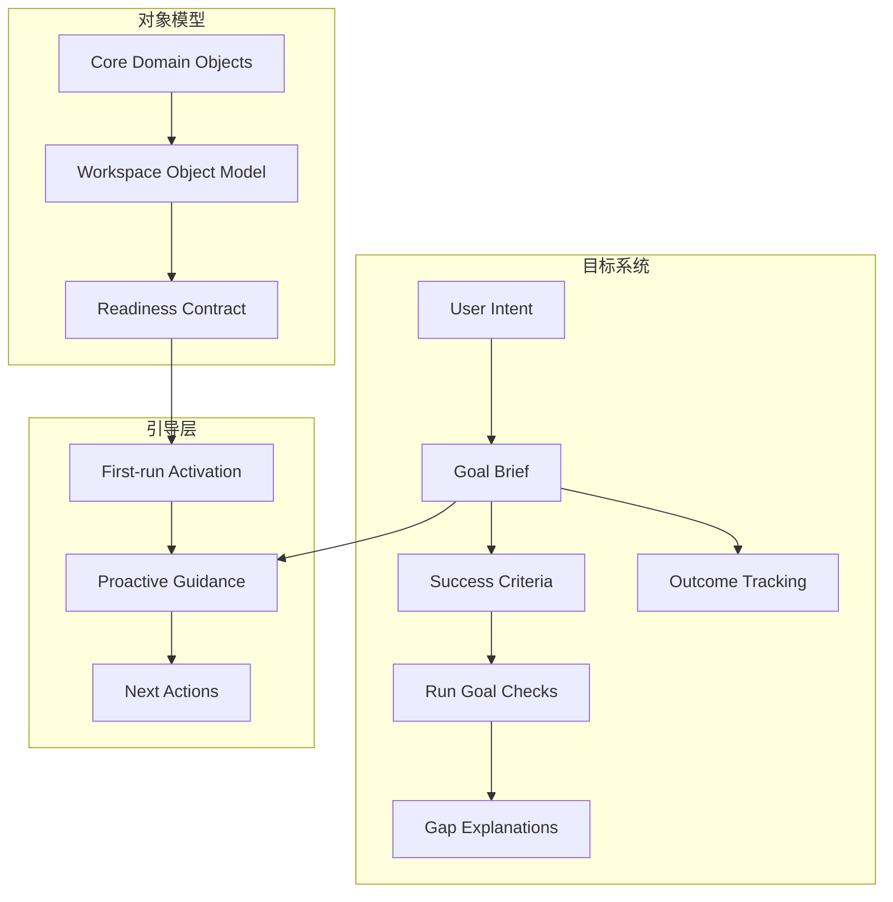

## Why

`c2000` 在定义 workspace object model / readiness，`c3000` 在定义 first-run activation，`c3001` 在定义 proactive next actions，`c2037` 在定义 goal briefs / success criteria / run goal contracts，`c2015` 在定义 outcome goals / impact tracking，`c2141` 在定义 goal-gap explanations / missed criteria reports。它们本质上都在建设同一层：**workspace 如何围绕统一对象、目标和 readiness 语义，引导用户从第一次成功走向长期目标推进**。

如果继续拆开推进，会有三个问题：

- object/readiness、first-run、next actions 和 goal contracts 会各自发明状态词汇与下一步动作，无法形成统一 guidance substrate。
- outcome goals 和 goal-gap explanations 如果不建立在同一 brief / readiness / next-step contract 上，就会变成事后报表，而不是可执行导航。
- first-run 与长期推进会继续像两套产品：一个只管入门，一个只管长期目标，中间没有共享对象与状态语义。

## Merge Notes

- 合并自 `workspace-object-model-and-readiness-contract`
- 合并自 `first-run-success-path`
- 合并自 `proactive-recommendations-and-next-best-actions`
- 合并自 `goal-briefs-and-success-criteria-contract`
- 合并自 `outcome-goals-and-impact-tracking`
- 合并自 `goal-gap-explanations-and-missed-criteria-reports`
- 合并自 `workspace-empty-state-seeding-and-safe-reset`

## What Changes

- 定义 workspace guidance substrate：
  - core domain objects、typed ids、readiness / degraded / blocked / recoverable 词汇
  - 每类对象的 next-step semantics 与可恢复路径
- 定义 first-run and progressive guidance：
  - first-run activation、guided demo、onboarding progress
  - proactive next-best actions 在空态、半完成态、结果态和长期推进阶段都复用同一 readiness/goal 语义
- 定义 goal-driven execution：
  - goal briefs、success criteria、run goal contracts、success checks
  - outcome goals / impact tracking 作为更高层目标归属
- 定义 gap reporting：
  - goal-gap explanations、missed criteria reports、follow-up suggestions
  - 把“没达成目标”变成可执行的继续路径，而不是模糊失败
- 定义 workspace seeding 与 safe reset：
  - 为空工作区快速注入最小可运行骨架（最小研究、写作、来源整理等播种包）
  - 安全重置：在不破坏已有资产的前提下，清理布局、临时状态和实验痕迹
  - reset 和 seed 做成可预览动作，先说明会改什么，再执行
  - 首页区分真正空态、可恢复乱态和建议重置态

## Capabilities

### New Capabilities

- `workspace-object-model-and-readiness`
- `workspace-empty-state-seeding-and-safe-reset`
- `core-domain-object-model`
- `first-run-activation`
- `proactive-guidance-and-next-actions`
- `goal-briefs-and-success-criteria`
- `run-goal-contracts-and-success-checks`
- `outcome-goals-and-impact-tracking`
- `goal-gap-explanations-and-missed-criteria-reports`

### Modified Capabilities

- `workspace-api-contract`
- `workspace-ui-core`
- `workspace-ui-panels`
- `workspace-command-registry`
- `publishable-artifacts`

## Impact

- Backend：对象摘要、typed id、readiness、goal briefs、goal tracking 与 guidance recommendations 会统一到一条 guidance contract。
- Frontend：first-run、空态、banner、next-best actions、goal panels 与 gap reports 会共用同一套状态和动作语义。
- Product：从首次成功到长期目标推进变成一条连续体验，而不是多条局部流程。
- Migration：默认直接收口到统一 guidance/readiness/goal substrate，不保留多套并行状态和下一步动作语义。

## Dependency Sketch

