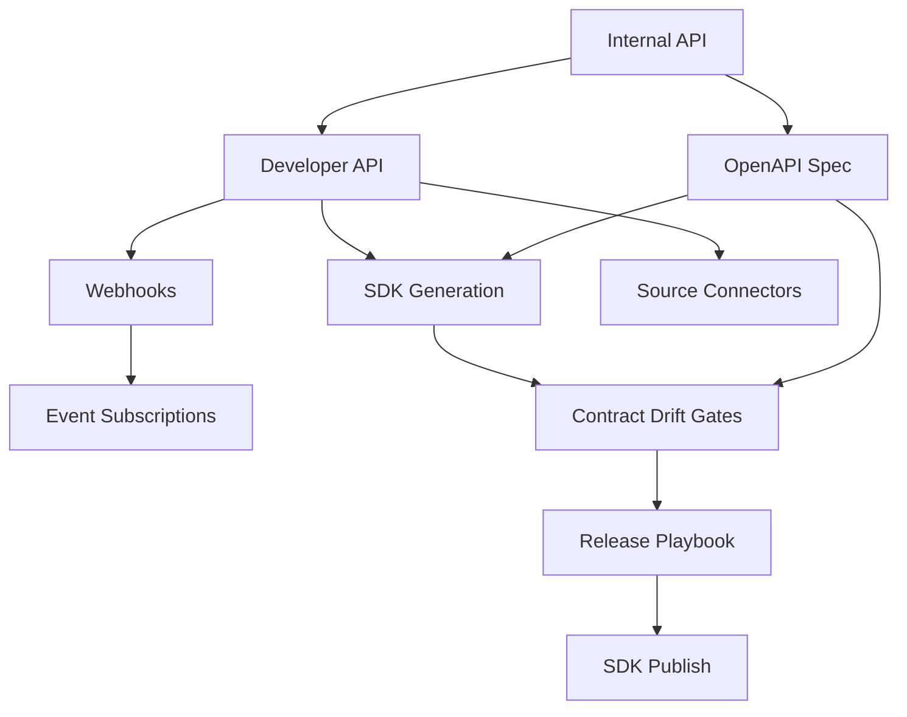

## Why

`c4002` 在定义 developer API / webhooks，`c2021` 在定义 SDK generation drift gates / release playbook。它们本质上都在治理同一层：**Crystalith 如何把内部 API 能力稳定地暴露给外部系统、外部开发者和官方 SDK**。

如果继续拆开推进，会有两个问题：

- public API、webhooks、generated SDK 和 release playbook 会分别定义“外部契约”，没有统一的 external platform 真相。
- drift gate 如果只盯内部 generated client，而不和 developer API / webhook versioning 一起治理，就无法真正保护外部生态。

## Merge Notes

- 合并自 `developer-api-and-webhook-automation`
- 合并自 `sdk-generation-drift-gates-and-release-playbook`

## What Changes

- 定义 external API surface：
  - developer API、token scopes、public OpenAPI boundary、event callback versioning
  - notebooks / sources / runs / knowledge packs / publish flows 的外部读取与触发语义
- 定义 webhook contract：
  - event versioning、signing、retry、delivery history、failure handling
  - source sync、research complete、approval complete、publish complete 等事件统一出口
- 定义 SDK generation governance：
  - SSOT schema、generated clients、external SDKs、drift types、contract drift watch
  - schema drift / generator drift / version drift / submodule drift 的分级与 gate
- 定义 release playbook：
  - TS / Python / Go / Rust SDK 的生成、检查、发布与 breaking-change 升级要求
  - 将 developer API 与官方 SDK 视为同一外部平台的两个入口

## Capabilities

### New Capabilities

- `developer-api-and-webhooks`
- `sdk-generation-drift-gates-and-release-playbook`
- `openapi-client-contract-drift-watch`

### Modified Capabilities

- `workspace-api-contract`
- `openapi-and-client-generation`
- `publishable-artifacts`
- `delivery-and-deployment`
- `source-connectors`

## Impact

- Backend：public API boundary、token management、webhook delivery 与 external event versioning 会统一收口。
- Tooling/CI：OpenAPI、generated client、SDK release 和 public API drift 会进入同一套 gate。
- Ecosystem：对外 API 和 SDK 不再只是内部副产物，而是受治理的正式平台能力。
- Migration：默认直接收口到统一 external platform governance，不保留散装的对外接口和 SDK 发布语义。

## Dependency Sketch

