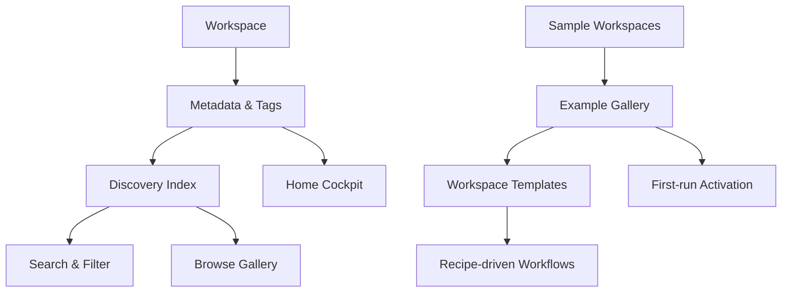

## Why

`c4007` 在定义 workspace metadata / tags / discovery，`c3004` 在定义 example gallery / sample workspaces。它们本质上都在建设同一层：**用户如何发现对象、理解对象、并从官方样板快速进入可用工作区**。

如果继续拆开推进，会有两个问题：

- metadata tags 和 example gallery 会各自维护一套对象发现语义，无法形成统一 discovery substrate。
- 样板库若不复用统一 metadata/tagging，后续搜索、筛选、推荐和公开展示都会再次各造一套分类体系。

## Merge Notes

- 合并自 `workspace-metadata-tags-and-discovery`
- 合并自 `example-gallery-and-sample-workspaces`

## What Changes

- 定义 workspace discovery substrate：
  - workspace / notebook / artifact / source 的统一 metadata layer
  - tags、owner、domain、sensitivity、expiry、goal links 的继承与覆盖规则
- 定义 example gallery：
  - 官方 sample workspaces、preview、copy-to-workspace、starter paths
  - gallery 使用同一套 metadata/discovery 语义进行组织、筛选与推荐
- 定义 discovery consistency：
  - 列表、过滤、推荐、样板库与公开展示共用同一 metadata index
  - 样板与真实 workspace 之间共享发现语义，但职责边界清晰

## Capabilities

### New Capabilities

- `workspace-metadata-tags-and-discovery`
- `example-gallery-and-sample-workspaces`

### Modified Capabilities

- `workspace-api-contract`
- `workspace-ui-core`
- `first-run-activation`
- `recipe-driven-workflows`
- `workspace-templates-and-operating-playbooks`

## Impact

- Backend：metadata storage、inheritance/indexing、gallery sample definitions 与 copy semantics 会统一收口。
- Frontend：搜索筛选、object discovery、sample preview 和 one-click copy 会复用同一 discovery model。
- Product：对象发现与样板上手不再是两条分开的路径，而是一条可搜索、可筛选、可复制的入口链。
- Migration：默认直接收口到统一 discovery substrate，不保留多套平行标签和样板分类语义。

## Dependency Sketch

